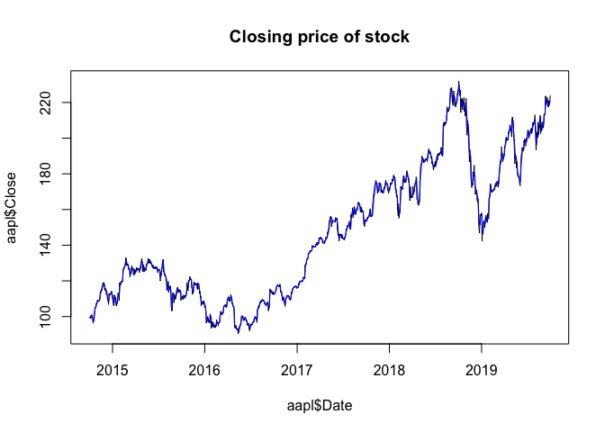

CKME 136 - Capstone
================
Michelle Law
2019-11-03

Load and examine data
---------------------

``` r
aapl <- read.csv("/Users/michellelaw/Documents/CKME999/8. CKME136 - Capstone Course /A.csv", stringsAsFactors = TRUE)
head(aapl)
```

    ##         Date     Open     High      Low    Close Adj.Close  Volume
    ## 1 2014-10-20 37.24607 37.46781 36.38054 37.44635  35.67288 6909100
    ## 2 2014-10-21 37.81116 38.64807 37.81116 38.62661  36.79723 3120100
    ## 3 2014-10-22 38.46209 38.52647 37.90415 37.94707  36.14988 3021200
    ## 4 2014-10-23 38.33333 38.77683 38.33333 38.41917  36.59963 2453000
    ## 5 2014-10-24 38.41202 38.70529 38.27611 38.66238  36.83131 2108400
    ## 6 2014-10-27 38.58369 38.70529 38.34049 38.61946  36.79043 1545200

``` r
str(aapl)
```

    ## 'data.frame':    1259 obs. of  7 variables:
    ##  $ Date     : Factor w/ 1259 levels "2014-10-20","2014-10-21",..: 1 2 3 4 5 6 7 8 9 10 ...
    ##  $ Open     : num  37.2 37.8 38.5 38.3 38.4 ...
    ##  $ High     : num  37.5 38.6 38.5 38.8 38.7 ...
    ##  $ Low      : num  36.4 37.8 37.9 38.3 38.3 ...
    ##  $ Close    : num  37.4 38.6 37.9 38.4 38.7 ...
    ##  $ Adj.Close: num  35.7 36.8 36.1 36.6 36.8 ...
    ##  $ Volume   : int  6909100 3120100 3021200 2453000 2108400 1545200 2394700 2074200 2883700 2918700 ...

``` r
summary(aapl)
```

    ##          Date           Open            High            Low       
    ##  2014-10-20:   1   Min.   :33.18   Min.   :34.06   Min.   :33.12  
    ##  2014-10-21:   1   1st Qu.:41.55   1st Qu.:41.91   1st Qu.:41.31  
    ##  2014-10-22:   1   Median :53.43   Median :54.05   Median :53.02  
    ##  2014-10-23:   1   Mean   :55.35   Mean   :55.84   Mean   :54.86  
    ##  2014-10-24:   1   3rd Qu.:67.59   3rd Qu.:68.19   3rd Qu.:67.03  
    ##  2014-10-27:   1   Max.   :81.88   Max.   :82.27   Max.   :81.46  
    ##  (Other)   :1253                                                  
    ##      Close         Adj.Close         Volume        
    ##  Min.   :33.37   Min.   :32.12   Min.   :  532700  
    ##  1st Qu.:41.61   1st Qu.:39.98   1st Qu.: 1549000  
    ##  Median :53.46   Median :52.29   Median : 2009400  
    ##  Mean   :55.36   Mean   :54.23   Mean   : 2291645  
    ##  3rd Qu.:67.61   3rd Qu.:66.80   3rd Qu.: 2712150  
    ##  Max.   :82.00   Max.   :81.58   Max.   :14523800  
    ## 

Converting to date format
-------------------------

``` r
aapl$Date <- as.Date(aapl$Date, "%Y-%m-%d")
head(aapl$Date)
```

    ## [1] "2014-10-20" "2014-10-21" "2014-10-22" "2014-10-23" "2014-10-24"
    ## [6] "2014-10-27"

Install relevant packages
-------------------------

``` r
## install.packages("zoo")
## install.packages("dplyr")

library(zoo) 
```

    ## 
    ## Attaching package: 'zoo'

    ## The following objects are masked from 'package:base':
    ## 
    ##     as.Date, as.Date.numeric

``` r
library(dplyr)
```

    ## 
    ## Attaching package: 'dplyr'

    ## The following objects are masked from 'package:stats':
    ## 
    ##     filter, lag

    ## The following objects are masked from 'package:base':
    ## 
    ##     intersect, setdiff, setequal, union

Adding attributes to dataset
----------------------------

``` r
## Adding Simple Moving Attribute as an attribute
aapl$SMA <- rollmean(aapl$Adj.Close, 3, fill = "extend", FUN = mean)

## Adding attribute that indicates change from previous day
aapl <- aapl %>% mutate(DiffAdjClose = Adj.Close - lag(Adj.Close))

## Adding Season as an attribute
months <- as.numeric(format(as.Date(aapl$Date, '%Y-%m-%d'), '%m'))
indx <- setNames( rep(c('Winter', 'Spring', 'Summer','Fall'),each=3), c(12,1:11))
aapl$Season <- as.factor(unname(indx[as.character(months)]))

head(aapl)
```

    ##         Date     Open     High      Low    Close Adj.Close  Volume
    ## 1 2014-10-20 37.24607 37.46781 36.38054 37.44635  35.67288 6909100
    ## 2 2014-10-21 37.81116 38.64807 37.81116 38.62661  36.79723 3120100
    ## 3 2014-10-22 38.46209 38.52647 37.90415 37.94707  36.14988 3021200
    ## 4 2014-10-23 38.33333 38.77683 38.33333 38.41917  36.59963 2453000
    ## 5 2014-10-24 38.41202 38.70529 38.27611 38.66238  36.83131 2108400
    ## 6 2014-10-27 38.58369 38.70529 38.34049 38.61946  36.79043 1545200
    ##        SMA DiffAdjClose Season
    ## 1 36.20666           NA   Fall
    ## 2 36.20666     1.124352   Fall
    ## 3 36.51558    -0.647358   Fall
    ## 4 36.52694     0.449749   Fall
    ## 5 36.74045     0.231681   Fall
    ## 6 36.95624    -0.040878   Fall

``` r
str(aapl)
```

    ## 'data.frame':    1259 obs. of  10 variables:
    ##  $ Date        : Date, format: "2014-10-20" "2014-10-21" ...
    ##  $ Open        : num  37.2 37.8 38.5 38.3 38.4 ...
    ##  $ High        : num  37.5 38.6 38.5 38.8 38.7 ...
    ##  $ Low         : num  36.4 37.8 37.9 38.3 38.3 ...
    ##  $ Close       : num  37.4 38.6 37.9 38.4 38.7 ...
    ##  $ Adj.Close   : num  35.7 36.8 36.1 36.6 36.8 ...
    ##  $ Volume      : int  6909100 3120100 3021200 2453000 2108400 1545200 2394700 2074200 2883700 2918700 ...
    ##  $ SMA         : num  36.2 36.2 36.5 36.5 36.7 ...
    ##  $ DiffAdjClose: num  NA 1.124 -0.647 0.45 0.232 ...
    ##  $ Season      : Factor w/ 4 levels "Fall","Spring",..: 1 1 1 1 1 1 1 1 1 1 ...

``` r
summary(aapl)
```

    ##       Date                 Open            High            Low       
    ##  Min.   :2014-10-20   Min.   :33.18   Min.   :34.06   Min.   :33.12  
    ##  1st Qu.:2016-01-20   1st Qu.:41.55   1st Qu.:41.91   1st Qu.:41.31  
    ##  Median :2017-04-20   Median :53.43   Median :54.05   Median :53.02  
    ##  Mean   :2017-04-19   Mean   :55.35   Mean   :55.84   Mean   :54.86  
    ##  3rd Qu.:2018-07-19   3rd Qu.:67.59   3rd Qu.:68.19   3rd Qu.:67.03  
    ##  Max.   :2019-10-18   Max.   :81.88   Max.   :82.27   Max.   :81.46  
    ##                                                                      
    ##      Close         Adj.Close         Volume              SMA       
    ##  Min.   :33.37   Min.   :32.12   Min.   :  532700   Min.   :32.55  
    ##  1st Qu.:41.61   1st Qu.:39.98   1st Qu.: 1549000   1st Qu.:39.95  
    ##  Median :53.46   Median :52.29   Median : 2009400   Median :52.19  
    ##  Mean   :55.36   Mean   :54.23   Mean   : 2291645   Mean   :54.23  
    ##  3rd Qu.:67.61   3rd Qu.:66.80   3rd Qu.: 2712150   3rd Qu.:66.71  
    ##  Max.   :82.00   Max.   :81.58   Max.   :14523800   Max.   :81.24  
    ##                                                                    
    ##   DiffAdjClose         Season   
    ##  Min.   :-8.33370   Fall  :315  
    ##  1st Qu.:-0.34624   Spring:319  
    ##  Median : 0.05775   Summer:324  
    ##  Mean   : 0.03092   Winter:301  
    ##  3rd Qu.: 0.47694               
    ##  Max.   : 4.86668               
    ##  NA's   :1

Check for any missing values and replace
========================================

``` r
sum(is.na(aapl))
```

    ## [1] 1

``` r
aapl$DiffAdjClose[1] <- 0
sum(is.na(aapl))
```

    ## [1] 0

Check for correlation between attributes
----------------------------------------

``` r
cor(aapl[2:9])
```

    ##                      Open        High         Low       Close   Adj.Close
    ## Open          1.000000000  0.99955438  0.99936152  0.99879563  0.99863916
    ## High          0.999554379  1.00000000  0.99930792  0.99940068  0.99932040
    ## Low           0.999361516  0.99930792  1.00000000  0.99952159  0.99924989
    ## Close         0.998795630  0.99940068  0.99952159  1.00000000  0.99980936
    ## Adj.Close     0.998639162  0.99932040  0.99924989  0.99980936  1.00000000
    ## Volume       -0.058089462 -0.04886125 -0.06945163 -0.06022232 -0.05785369
    ## SMA           0.998950885  0.99931421  0.99911600  0.99934555  0.99958829
    ## DiffAdjClose -0.003238013  0.01108320  0.01816364  0.03318148  0.03179663
    ##                   Volume         SMA DiffAdjClose
    ## Open         -0.05808946  0.99895089 -0.003238013
    ## High         -0.04886125  0.99931421  0.011083202
    ## Low          -0.06945163  0.99911600  0.018163643
    ## Close        -0.06022232  0.99934555  0.033181485
    ## Adj.Close    -0.05785369  0.99958829  0.031796631
    ## Volume        1.00000000 -0.05433264 -0.147672058
    ## SMA          -0.05433264  1.00000000  0.010867854
    ## DiffAdjClose -0.14767206  0.01086785  1.000000000

Visualization of data spread
----------------------------

``` r
par(mfrow = c(1, 1))
hist(aapl$Open, main = "Distribution of Opening Prices of Apple Stock")
```


``` r
hist(aapl$High, main = "Distribution of High Prices of Apple Stock")
```


``` r
hist(aapl$Low, main = "Distribution of Low Prices of Apple Stock")
```


``` r
hist(aapl$Close, main = "Distribution of Close Prices of Apple Stock")
```


``` r
hist(aapl$Adj.Close, main = "Distribution of Adjusted Closing Prices of Apple Stock")
```


``` r
hist(aapl$Volume, main = "Distribution of Volume of Apple Stock")
```


``` r
hist(aapl$SMA, main = "Distribution of Simple Moving Average of Apple Stock")
```


``` r
boxplot(aapl$SMA, aapl$Adj.Close, aapl$Low, aapl$High, aapl$Open, main = "Display of Open, High, Low, Close, and SMA", horizontal = TRUE, names = c("SMA", "AdjClose", "Low", "High", "Open"), col = c("beige", "pink", "orange", "yellow", " light green"))
```


``` r
boxplot(aapl$Open, main = "Boxplot of Opening Prices of Apple Stock")
```


``` r
boxplot(aapl$High, main = "Boxplot of High Prices of Apple Stock")
```


``` r
boxplot(aapl$Low, main = "Boxplot of Low Prices of Apple Stock")
```


``` r
boxplot(aapl$Close, main = "Boxplot of Closing Prices of Apple Stock")
```


``` r
boxplot(aapl$Adj.Close, main = "Boxplot of Adjusted Closing Prices of Apple Stock")
```


``` r
boxplot(aapl$Volume, main = "Boxplot of Volume of Apple Stock")
```


``` r
boxplot(aapl$SMA, main = "Boxplot of Simple Moving Average of Apple Stock")
```


Visualize closing price and simple moving average
-------------------------------------------------

``` r
attach(aapl)
plot(aapl$Date, aapl$Close, type = "l", main = "Closing price of stock")
lines(aapl$Date, aapl$SMA, type = "l", col = "blue") 
```



``` r
shapiro.test(aapl$Open)
```

    ## 
    ##  Shapiro-Wilk normality test
    ## 
    ## data:  aapl$Open
    ## W = 0.90667, p-value < 2.2e-16

``` r
shapiro.test(aapl$High)
```

    ## 
    ##  Shapiro-Wilk normality test
    ## 
    ## data:  aapl$High
    ## W = 0.90416, p-value < 2.2e-16

``` r
shapiro.test(aapl$Low)
```

    ## 
    ##  Shapiro-Wilk normality test
    ## 
    ## data:  aapl$Low
    ## W = 0.90841, p-value < 2.2e-16

``` r
shapiro.test(aapl$Close)
```

    ## 
    ##  Shapiro-Wilk normality test
    ## 
    ## data:  aapl$Close
    ## W = 0.90654, p-value < 2.2e-16

``` r
shapiro.test(aapl$Adj.Close)
```

    ## 
    ##  Shapiro-Wilk normality test
    ## 
    ## data:  aapl$Adj.Close
    ## W = 0.90472, p-value < 2.2e-16

``` r
## Not normal distribution
```

Microsoft data for later use
----------------------------

``` r
msft <- read.csv("/Users/michellelaw/Documents/CKME999/8. CKME136 - Capstone Course /MSFT.csv", stringsAsFactors = FALSE)

summary(msft)
```

    ##      Date                Open             High             Low        
    ##  Length:1259        Min.   : 40.34   Min.   : 40.74   Min.   : 39.72  
    ##  Class :character   1st Qu.: 51.83   1st Qu.: 52.24   1st Qu.: 51.12  
    ##  Mode  :character   Median : 65.85   Median : 66.35   Median : 65.45  
    ##                     Mean   : 76.98   Mean   : 77.62   Mean   : 76.29  
    ##                     3rd Qu.:101.95   3rd Qu.:102.56   3rd Qu.:100.99  
    ##                     Max.   :141.50   Max.   :142.37   Max.   :140.30  
    ##      Close          Adj.Close          Volume         
    ##  Min.   : 40.29   Min.   : 36.39   Min.   :  7425600  
    ##  1st Qu.: 51.79   1st Qu.: 48.27   1st Qu.: 21136150  
    ##  Median : 65.86   Median : 62.99   Median : 26329200  
    ##  Mean   : 76.99   Mean   : 74.30   Mean   : 29442954  
    ##  3rd Qu.:101.90   3rd Qu.:100.30   3rd Qu.: 33623150  
    ##  Max.   :141.57   Max.   :141.57   Max.   :169164000

``` r
msft$Date <- as.Date(msft$Date, "%Y-%m-%d")
```
