CKME 136 - Capstone
================
Michelle Law
2019-11-03

Load and examine data
---------------------

``` r
aapl <- read.csv("/Users/michellelaw/Documents/CKME999/8. CKME136 - Capstone Course /AAPL.csv", stringsAsFactors = TRUE)
head(aapl)
```

    ##         Date   Open   High   Low  Close Adj.Close   Volume
    ## 1 2014-10-01 100.59 100.69 98.70  99.18  90.73487 51491300
    ## 2 2014-10-02  99.27 100.22 98.04  99.90  91.39356 47757800
    ## 3 2014-10-03  99.44 100.21 99.04  99.62  91.13739 43469600
    ## 4 2014-10-06  99.95 100.65 99.42  99.62  91.13739 37051200
    ## 5 2014-10-07  99.43 100.12 98.73  98.75  90.34148 42094200
    ## 6 2014-10-08  98.76 101.11 98.31 100.80  92.21692 57404700

``` r
str(aapl)
```

    ## 'data.frame':    1258 obs. of  7 variables:
    ##  $ Date     : Factor w/ 1258 levels "2014-10-01","2014-10-02",..: 1 2 3 4 5 6 7 8 9 10 ...
    ##  $ Open     : num  100.6 99.3 99.4 99.9 99.4 ...
    ##  $ High     : num  101 100 100 101 100 ...
    ##  $ Low      : num  98.7 98 99 99.4 98.7 ...
    ##  $ Close    : num  99.2 99.9 99.6 99.6 98.8 ...
    ##  $ Adj.Close: num  90.7 91.4 91.1 91.1 90.3 ...
    ##  $ Volume   : int  51491300 47757800 43469600 37051200 42094200 57404700 77376500 66331600 53583400 63688600 ...

``` r
summary(aapl)
```

    ##          Date           Open            High             Low        
    ##  2014-10-01:   1   Min.   : 90.0   Min.   : 91.67   Min.   : 89.47  
    ##  2014-10-02:   1   1st Qu.:113.0   1st Qu.:114.18   1st Qu.:111.82  
    ##  2014-10-03:   1   Median :141.6   Median :142.26   Median :140.74  
    ##  2014-10-06:   1   Mean   :146.9   Mean   :148.19   Mean   :145.59  
    ##  2014-10-07:   1   3rd Qu.:175.2   3rd Qu.:177.18   3rd Qu.:174.48  
    ##  2014-10-08:   1   Max.   :230.8   Max.   :233.47   Max.   :229.78  
    ##  (Other)   :1252                                                    
    ##      Close          Adj.Close         Volume         
    ##  Min.   : 90.34   Min.   : 85.4   Min.   : 11362000  
    ##  1st Qu.:113.01   1st Qu.:105.9   1st Qu.: 24553725  
    ##  Median :141.55   Median :135.8   Median : 32483250  
    ##  Mean   :146.92   Mean   :141.5   Mean   : 37172119  
    ##  3rd Qu.:175.75   3rd Qu.:172.1   3rd Qu.: 44975725  
    ##  Max.   :232.07   Max.   :227.8   Max.   :162206300  
    ## 

Converting to date format
-------------------------

``` r
aapl$Date <- as.Date(aapl$Date, "%Y-%m-%d")
head(aapl$Date)
```

    ## [1] "2014-10-01" "2014-10-02" "2014-10-03" "2014-10-06" "2014-10-07"
    ## [6] "2014-10-08"

Install relevant packages
-------------------------

``` r
## install.packages("zoo")
## install.packages("dplyr")
## install.packages("quantmod")
## install.packages("gtools")

library(zoo) 
```

    ## 
    ## Attaching package: 'zoo'

    ## The following objects are masked from 'package:base':
    ## 
    ##     as.Date, as.Date.numeric

``` r
library(dplyr)
```

    ## 
    ## Attaching package: 'dplyr'

    ## The following objects are masked from 'package:stats':
    ## 
    ##     filter, lag

    ## The following objects are masked from 'package:base':
    ## 
    ##     intersect, setdiff, setequal, union

``` r
library(quantmod)
```

    ## Loading required package: xts

    ## 
    ## Attaching package: 'xts'

    ## The following objects are masked from 'package:dplyr':
    ## 
    ##     first, last

    ## Loading required package: TTR

    ## Version 0.4-0 included new data defaults. See ?getSymbols.

``` r
library(gtools)
```

Adding attributes to dataset
----------------------------

``` r
## Adding Season as an attribute
months <- as.numeric(format(as.Date(aapl$Date, '%Y-%m-%d'), '%m'))
indx <- setNames( rep(c('Winter', 'Spring', 'Summer','Fall'),each=3), c(12,1:11))
aapl$Season <- as.factor(unname(indx[as.character(months)]))

## Adding attribute that indicates change from previous day
aapl$DiffClose <- momentum(aapl$Close, n = 1)

## Adding Simple Moving Attribute as an attribute
aapl$SMA <- SMA(aapl$Close, n = 3)

## Adding MACD as an attribute. If MACD goes above the signal line we long, if it goes below the signal line we short.
macd <- MACD(aapl$Close, nFast=12, nSlow=26,nSig=9,maType=SMA, percent = FALSE)
aapl <- data.frame(aapl, macd)

## Adding Exponential Moving Average as an attribute
aapl$EMA <- EMA(aapl$Close, n = 3)

## Adding Momentum as an attribute
aapl$momentum <- momentum(aapl$Close, n = 3)

## Adding ROC as an attribute
aapl$ROC <- ROC(aapl$Close, n = 2)

## Adding RSI as an attribute
aapl$RSI <- RSI(aapl$Close, n = 7)

## Adding Bollinger Band as an attribute
BB <- BBands(aapl[,c("High", "Low", "Close")], n = 3, s.d = 2)
aapl <- data.frame(aapl, BB)

head(aapl)
```

    ##         Date   Open   High   Low  Close Adj.Close   Volume Season
    ## 1 2014-10-01 100.59 100.69 98.70  99.18  90.73487 51491300   Fall
    ## 2 2014-10-02  99.27 100.22 98.04  99.90  91.39356 47757800   Fall
    ## 3 2014-10-03  99.44 100.21 99.04  99.62  91.13739 43469600   Fall
    ## 4 2014-10-06  99.95 100.65 99.42  99.62  91.13739 37051200   Fall
    ## 5 2014-10-07  99.43 100.12 98.73  98.75  90.34148 42094200   Fall
    ## 6 2014-10-08  98.76 101.11 98.31 100.80  92.21692 57404700   Fall
    ##   DiffClose      SMA macd signal      EMA  momentum          ROC RSI
    ## 1        NA       NA   NA     NA       NA        NA           NA  NA
    ## 2  0.720002       NA   NA     NA       NA        NA           NA  NA
    ## 3 -0.279999 99.56667   NA     NA 99.56667        NA  0.004426597  NA
    ## 4  0.000000 99.71334   NA     NA 99.59334  0.440003 -0.002806728  NA
    ## 5 -0.870003 99.33000   NA     NA 99.17167 -1.150002 -0.008771574  NA
    ## 6  2.050003 99.72334   NA     NA 99.98584  1.180000  0.011775408  NA
    ##         dn     mavg        up      pctB
    ## 1       NA       NA        NA        NA
    ## 2       NA       NA        NA        NA
    ## 3 99.31710 99.51111  99.70512 0.7892205
    ## 4 99.21879 99.63556 100.05233 0.8132543
    ## 5 99.00013 99.57333 100.14654 0.1743453
    ## 6 98.96930 99.72333 100.47736 0.7320859

``` r
str(aapl)
```

    ## 'data.frame':    1258 obs. of  20 variables:
    ##  $ Date     : Date, format: "2014-10-01" "2014-10-02" ...
    ##  $ Open     : num  100.6 99.3 99.4 99.9 99.4 ...
    ##  $ High     : num  101 100 100 101 100 ...
    ##  $ Low      : num  98.7 98 99 99.4 98.7 ...
    ##  $ Close    : num  99.2 99.9 99.6 99.6 98.8 ...
    ##  $ Adj.Close: num  90.7 91.4 91.1 91.1 90.3 ...
    ##  $ Volume   : int  51491300 47757800 43469600 37051200 42094200 57404700 77376500 66331600 53583400 63688600 ...
    ##  $ Season   : Factor w/ 4 levels "Fall","Spring",..: 1 1 1 1 1 1 1 1 1 1 ...
    ##  $ DiffClose: num  NA 0.72 -0.28 0 -0.87 ...
    ##  $ SMA      : num  NA NA 99.6 99.7 99.3 ...
    ##  $ macd     : num  NA NA NA NA NA NA NA NA NA NA ...
    ##  $ signal   : num  NA NA NA NA NA NA NA NA NA NA ...
    ##  $ EMA      : num  NA NA 99.6 99.6 99.2 ...
    ##  $ momentum : num  NA NA NA 0.44 -1.15 ...
    ##  $ ROC      : num  NA NA 0.00443 -0.00281 -0.00877 ...
    ##  $ RSI      : num  NA NA NA NA NA ...
    ##  $ dn       : num  NA NA 99.3 99.2 99 ...
    ##  $ mavg     : num  NA NA 99.5 99.6 99.6 ...
    ##  $ up       : num  NA NA 99.7 100.1 100.1 ...
    ##  $ pctB     : num  NA NA 0.789 0.813 0.174 ...

``` r
summary(aapl)
```

    ##       Date                 Open            High             Low        
    ##  Min.   :2014-10-01   Min.   : 90.0   Min.   : 91.67   Min.   : 89.47  
    ##  1st Qu.:2015-12-30   1st Qu.:113.0   1st Qu.:114.18   1st Qu.:111.82  
    ##  Median :2017-03-30   Median :141.6   Median :142.26   Median :140.74  
    ##  Mean   :2017-03-31   Mean   :146.9   Mean   :148.19   Mean   :145.59  
    ##  3rd Qu.:2018-06-28   3rd Qu.:175.2   3rd Qu.:177.18   3rd Qu.:174.48  
    ##  Max.   :2019-09-30   Max.   :230.8   Max.   :233.47   Max.   :229.78  
    ##                                                                        
    ##      Close          Adj.Close         Volume             Season   
    ##  Min.   : 90.34   Min.   : 85.4   Min.   : 11362000   Fall  :314  
    ##  1st Qu.:113.01   1st Qu.:105.9   1st Qu.: 24553725   Spring:319  
    ##  Median :141.55   Median :135.8   Median : 32483250   Summer:324  
    ##  Mean   :146.92   Mean   :141.5   Mean   : 37172119   Winter:301  
    ##  3rd Qu.:175.75   3rd Qu.:172.1   3rd Qu.: 44975725               
    ##  Max.   :232.07   Max.   :227.8   Max.   :162206300               
    ##                                                                   
    ##    DiffClose              SMA              macd         
    ##  Min.   :-15.73000   Min.   : 91.12   Min.   :-15.7615  
    ##  1st Qu.: -0.88001   1st Qu.:112.97   1st Qu.: -1.3118  
    ##  Median :  0.08000   Median :141.53   Median :  1.0379  
    ##  Mean   :  0.09928   Mean   :146.90   Mean   :  0.6575  
    ##  3rd Qu.:  1.30000   3rd Qu.:175.65   3rd Qu.:  3.1117  
    ##  Max.   : 11.21001   Max.   :229.78   Max.   :  9.3170  
    ##  NA's   :1           NA's   :2        NA's   :25        
    ##      signal              EMA            momentum            ROC           
    ##  Min.   :-14.4709   Min.   : 91.06   Min.   :-19.700   Min.   :-0.103784  
    ##  1st Qu.: -1.2242   1st Qu.:112.97   1st Qu.: -1.640   1st Qu.:-0.009609  
    ##  Median :  0.9380   Median :141.74   Median :  0.420   Median : 0.002246  
    ##  Mean   :  0.6306   Mean   :146.90   Mean   :  0.290   Mean   : 0.001273  
    ##  3rd Qu.:  3.0123   3rd Qu.:175.85   3rd Qu.:  2.475   3rd Qu.: 0.013312  
    ##  Max.   :  8.5609   Max.   :229.80   Max.   : 17.700   Max.   : 0.086052  
    ##  NA's   :33         NA's   :2        NA's   :3         NA's   :2          
    ##       RSI               dn              mavg              up        
    ##  Min.   : 7.772   Min.   : 89.26   Min.   : 91.48   Min.   : 93.16  
    ##  1st Qu.:41.559   1st Qu.:111.63   1st Qu.:113.01   1st Qu.:114.77  
    ##  Median :55.865   Median :140.71   Median :141.56   Median :142.13  
    ##  Mean   :55.331   Mean   :144.73   Mean   :146.88   Mean   :149.03  
    ##  3rd Qu.:70.047   3rd Qu.:173.50   3rd Qu.:175.40   3rd Qu.:178.98  
    ##  Max.   :94.046   Max.   :227.02   Max.   :229.81   Max.   :234.47  
    ##  NA's   :7        NA's   :2        NA's   :2        NA's   :2       
    ##       pctB       
    ##  Min.   :0.1464  
    ##  1st Qu.:0.2283  
    ##  Median :0.6197  
    ##  Mean   :0.5325  
    ##  3rd Qu.:0.7915  
    ##  Max.   :0.8536  
    ##  NA's   :2

Check for any missing values and replace
========================================

``` r
sum(is.na(aapl[1:8]))
```

    ## [1] 0

``` r
sum(is.na(aapl$DiffClose))
```

    ## [1] 1

``` r
hist(aapl$DiffClose)
```

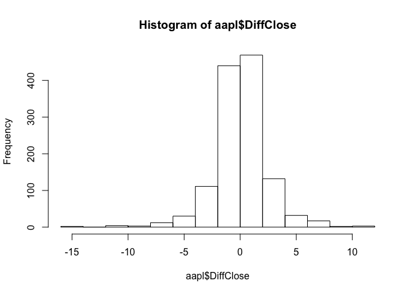

``` r
mean(aapl$DiffClose, na.rm = TRUE)
```

    ## [1] 0.09927605

``` r
## Since the mean is normally distributed, I will replace the missing value with the mean of 1.15
aapl$DiffClose[1] <- mean(aapl$DiffClose, na.rm = TRUE)

sum(is.na(aapl$SMA))
```

    ## [1] 2

``` r
hist(aapl$SMA[1:52])
```

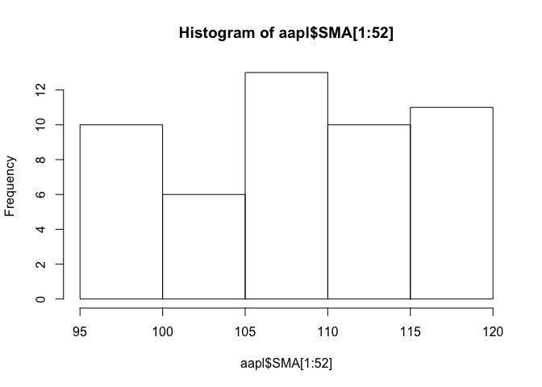

``` r
## Since the simple moving average takes into account the prices from a window of 3 days, I decided to replace the first two missing attributes with the average of the prices of the first 3 days.
aapl$SMA[1:2] <- mean(aapl$Close[1:3])

sum(is.na(aapl$macd))
```

    ## [1] 25

``` r
hist(aapl$macd)
```

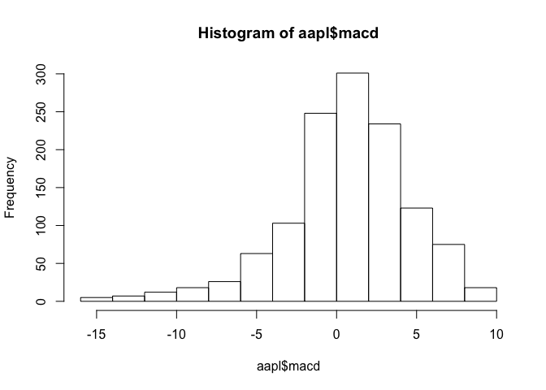

``` r
aapl$macd[1:25] <- median(aapl$macd, na.rm = TRUE)

sum(is.na(aapl$signal))
```

    ## [1] 33

``` r
hist(aapl$signal)
```

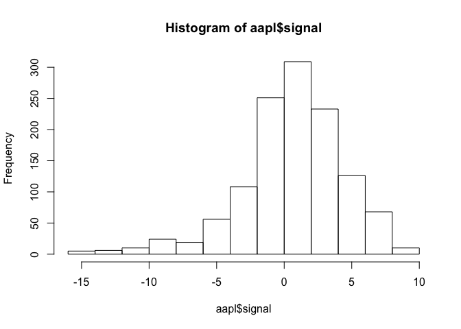

``` r
aapl$signal[1:33] <- mean(aapl$signal, na.rm = TRUE)

sum(is.na(aapl$EMA))
```

    ## [1] 2

``` r
hist(aapl$EMA)
```

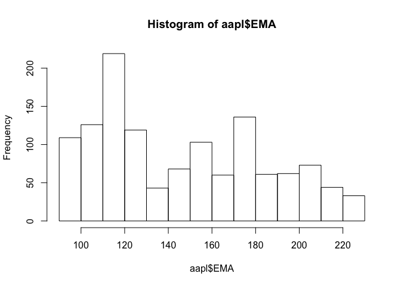

``` r
aapl$EMA[1:2] <- mean(aapl$Close[1:3])

sum(is.na(aapl$momentum))
```

    ## [1] 3

``` r
hist(aapl$momentum)
```

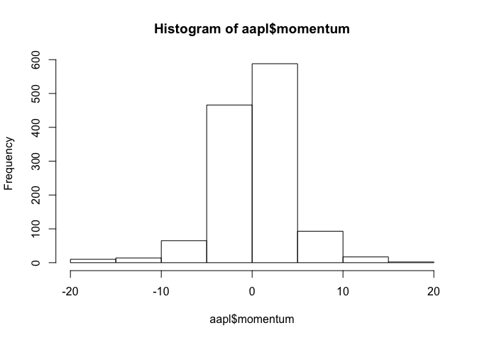

``` r
aapl$momentum[1:3] <- mean(aapl$momentum, na.rm = TRUE)

sum(is.na(aapl$ROC))
```

    ## [1] 2

``` r
hist(aapl$ROC)
```

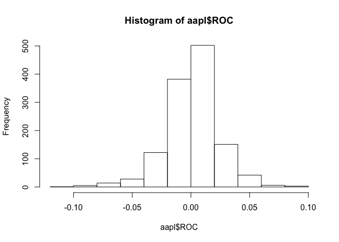

``` r
aapl$ROC[1:2] <- mean(aapl$ROC, na.rm = TRUE)

sum(is.na(aapl$RSI))
```

    ## [1] 7

``` r
hist(aapl$RSI)
```

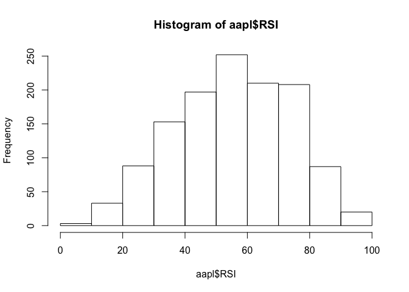

``` r
aapl$RSI[1:7] <- median(aapl$RSI, na.rm = TRUE)

sum(is.na(aapl$dn))
```

    ## [1] 2

``` r
hist(aapl$dn)
```

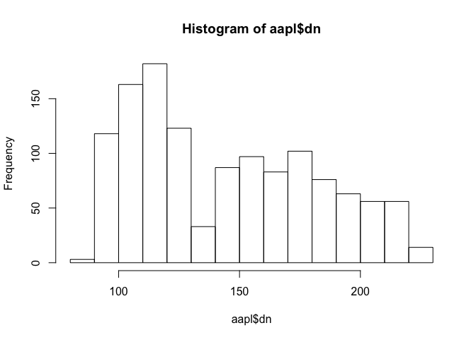

``` r
aapl$dn[1:2] <- aapl$dn[3]

sum(is.na(aapl$mavg))
```

    ## [1] 2

``` r
hist(aapl$dn)
```


``` r
aapl$mavg[1:2] <- aapl$mavg[3]

sum(is.na(aapl$up))
```

    ## [1] 2

``` r
hist(aapl$up)
```

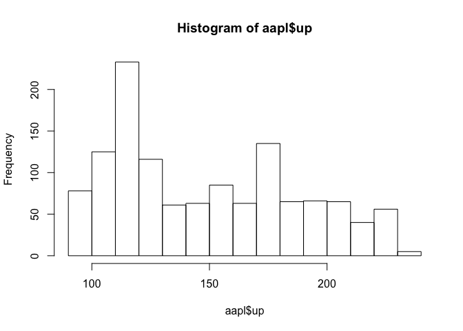

``` r
aapl$up[1:2] <- aapl$up[3]

sum(is.na(aapl$pctB))
```

    ## [1] 2

``` r
hist(aapl$pctB)
```

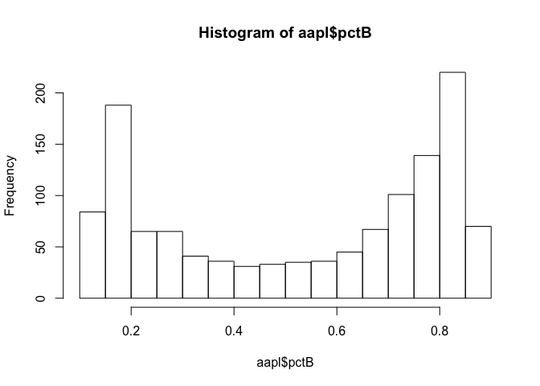

``` r
aapl$pctB[1:2] <- aapl$pctB[3]

sum(is.na(aapl))
```

    ## [1] 0

Check for correlation between attributes
----------------------------------------

``` r
nodate <- aapl[,2:20]
aaplnum <- nodate[-7]

cor(aaplnum)
```

    ##                  Open        High         Low       Close   Adj.Close
    ## Open       1.00000000  0.99949792  0.99936144  0.99887052  0.99789267
    ## High       0.99949792  1.00000000  0.99919445  0.99942066  0.99850075
    ## Low        0.99936144  0.99919445  1.00000000  0.99948553  0.99849387
    ## Close      0.99887052  0.99942066  0.99948553  1.00000000  0.99902407
    ## Adj.Close  0.99789267  0.99850075  0.99849387  0.99902407  1.00000000
    ## Volume    -0.34418395 -0.33504679 -0.35920324 -0.34921767 -0.35881028
    ## DiffClose  0.01225880  0.02636389  0.03258693  0.04769686  0.04566785
    ## SMA        0.99922449  0.99924820  0.99891211  0.99887395  0.99802649
    ## macd       0.20150303  0.19577889  0.20872261  0.20246904  0.19359824
    ## signal     0.21739266  0.21246077  0.22362890  0.21820741  0.20859775
    ## EMA        0.99931907  0.99950664  0.99919878  0.99934215  0.99849128
    ## momentum   0.05910345  0.06381883  0.07442440  0.07898566  0.07547833
    ## ROC        0.02848414  0.03535003  0.04435024  0.05175955  0.04870760
    ## RSI        0.12746074  0.12857152  0.14326146  0.14345051  0.13853235
    ## dn         0.99819779  0.99766980  0.99828770  0.99767839  0.99666102
    ## mavg       0.99918779  0.99915912  0.99874778  0.99860702  0.99776785
    ## up         0.99784991  0.99830426  0.99689837  0.99721113  0.99654625
    ## pctB       0.03878482  0.04649959  0.05464793  0.05948183  0.05709462
    ##               Volume    DiffClose          SMA        macd      signal
    ## Open      -0.3441839  0.012258800  0.999224492  0.20150303  0.21739266
    ## High      -0.3350468  0.026363891  0.999248196  0.19577889  0.21246077
    ## Low       -0.3592032  0.032586926  0.998912112  0.20872261  0.22362890
    ## Close     -0.3492177  0.047696858  0.998873951  0.20246904  0.21820741
    ## Adj.Close -0.3588103  0.045667850  0.998026492  0.19359824  0.20859775
    ## Volume     1.0000000 -0.116189968 -0.342583522 -0.24551557 -0.22276445
    ## DiffClose -0.1161900  1.000000000  0.005241914  0.06368898  0.03719603
    ## SMA       -0.3425835  0.005241914  1.000000000  0.19826596  0.21611600
    ## macd      -0.2455156  0.063688975  0.198265963  1.00000000  0.90639839
    ## signal    -0.2227644  0.037196033  0.216116003  0.90639839  1.00000000
    ## EMA       -0.3435238  0.016283997  0.999883024  0.19731405  0.21572644
    ## momentum  -0.1760103  0.558840198  0.042890972  0.15568307  0.07895735
    ## ROC       -0.1681476  0.684268253  0.008272898  0.09958696  0.04620507
    ## RSI       -0.2894949  0.424291483  0.117761823  0.54054416  0.37469542
    ## dn        -0.3674124  0.005544909  0.998766985  0.21237116  0.22931236
    ## mavg      -0.3411796  0.001751064  0.999954055  0.19786463  0.21595636
    ## up        -0.3150230 -0.001922454  0.998805030  0.18337903  0.20254201
    ## pctB      -0.1379698  0.606190710  0.025142691  0.07751559  0.02905603
    ##                   EMA    momentum          ROC        RSI           dn
    ## Open       0.99931907  0.05910345  0.028484143  0.1274607  0.998197794
    ## High       0.99950664  0.06381883  0.035350029  0.1285715  0.997669799
    ## Low        0.99919878  0.07442440  0.044350241  0.1432615  0.998287704
    ## Close      0.99934215  0.07898566  0.051759548  0.1434505  0.997678386
    ## Adj.Close  0.99849128  0.07547833  0.048707595  0.1385324  0.996661016
    ## Volume    -0.34352378 -0.17601031 -0.168147603 -0.2894949 -0.367412365
    ## DiffClose  0.01628400  0.55884020  0.684268253  0.4242915  0.005544909
    ## SMA        0.99988302  0.04289097  0.008272898  0.1177618  0.998766985
    ## macd       0.19731405  0.15568307  0.099586955  0.5405442  0.212371155
    ## signal     0.21572644  0.07895735  0.046205070  0.3746954  0.229312355
    ## EMA        1.00000000  0.04769898  0.019525229  0.1198010  0.998637907
    ## momentum   0.04769898  1.00000000  0.787559888  0.6542003  0.043602751
    ## ROC        0.01952523  0.78755989  1.000000000  0.5882111  0.008515316
    ## RSI        0.11980102  0.65420026  0.588211145  1.0000000  0.123924632
    ## dn         0.99863791  0.04360275  0.008515316  0.1239246  1.000000000
    ## mavg       0.99980887  0.03662050  0.003478567  0.1136025  0.998792619
    ## up         0.99864459  0.02978299 -0.001401085  0.1033576  0.995330293
    ## pctB       0.03345944  0.61814956  0.744920570  0.5705619  0.023346674
    ##                   mavg           up        pctB
    ## Open       0.999187789  0.997849909  0.03878482
    ## High       0.999159116  0.998304258  0.04649959
    ## Low        0.998747784  0.996898369  0.05464793
    ## Close      0.998607024  0.997211131  0.05948183
    ## Adj.Close  0.997767855  0.996546250  0.05709462
    ## Volume    -0.341179645 -0.315022959 -0.13796982
    ## DiffClose  0.001751064 -0.001922454  0.60619071
    ## SMA        0.999954055  0.998805030  0.02514269
    ## macd       0.197864629  0.183379027  0.07751559
    ## signal     0.215956358  0.202542012  0.02905603
    ## EMA        0.999808867  0.998644593  0.03345944
    ## momentum   0.036620504  0.029782985  0.61814956
    ## ROC        0.003478567 -0.001401085  0.74492057
    ## RSI        0.113602460  0.103357638  0.57056186
    ## dn         0.998792619  0.995330293  0.02334667
    ## mavg       1.000000000  0.998870514  0.02084479
    ## up         0.998870514  1.000000000  0.01837703
    ## pctB       0.020844794  0.018377031  1.00000000

Visualization of data spread
----------------------------

``` r
boxplot(aapl$SMA, aapl$Adj.Close, aapl$Low, aapl$High, aapl$Open, main = "Display of Open, High, Low, Close, and SMA", horizontal = TRUE, names = c("SMA", "AdjClose", "Low", "High", "Open"), col = c("beige", "pink", "orange", "yellow", " light green"))
```


``` r
boxplot(aapl$Open, main = "Boxplot of Opening Prices of Apple Stock")
```


``` r
boxplot(aapl$High, main = "Boxplot of High Prices of Apple Stock")
```


``` r
boxplot(aapl$Low, main = "Boxplot of Low Prices of Apple Stock")
```


``` r
boxplot(aapl$Close, main = "Boxplot of Closing Prices of Apple Stock")
```


``` r
boxplot(aapl$Adj.Close, main = "Boxplot of Adjusted Closing Prices of Apple Stock")
```


``` r
boxplot(aapl$Volume, main = "Boxplot of Volume of Apple Stock")
```


``` r
boxplot(aapl$SMA, main = "Boxplot of Simple Moving Average of Apple Stock")
```


Visualize closing price and simple moving average
-------------------------------------------------

``` r
plot(aapl$Date, aapl$Close, type = "l", main = "Closing price of stock")
lines(aapl$Date, aapl$SMA, type = "l", col = "blue") 
```


``` r
aaplxts <- xts(aapl$Close, aapl$Date)
chartSeries(aaplxts, TA="addMACD()", theme = "white")
```

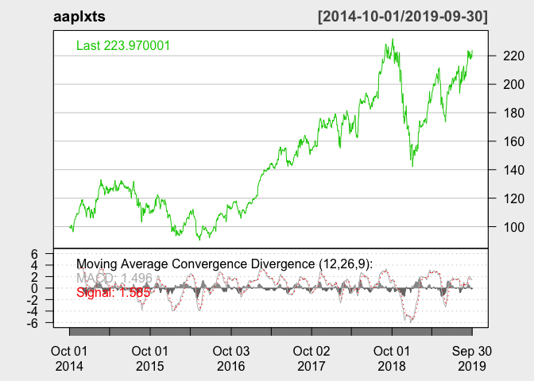

``` r
attach(aapl)
```

    ## The following object is masked _by_ .GlobalEnv:
    ## 
    ##     macd

``` r
plot(aapl$Date, aapl$Close, type = "l")
```


``` r
##curve(predict(model,aapl$Close,type="resp"),add=TRUE)

model <- glm(Close ~ Open + High + Low + DiffClose + SMA + macd + signal + EMA + momentum + ROC + RSI + dn + mavg + pctB, data = aapl)
summary(model)
```

    ## 
    ## Call:
    ## glm(formula = Close ~ Open + High + Low + DiffClose + SMA + macd + 
    ##     signal + EMA + momentum + ROC + RSI + dn + mavg + pctB, data = aapl)
    ## 
    ## Deviance Residuals: 
    ##      Min        1Q    Median        3Q       Max  
    ## -0.77368  -0.08016  -0.00422   0.08373   0.64377  
    ## 
    ## Coefficients:
    ##               Estimate Std. Error t value Pr(>|t|)    
    ## (Intercept) -0.2442397  0.0342683  -7.127 1.73e-12 ***
    ## Open        -0.0287782  0.0060931  -4.723 2.59e-06 ***
    ## High         0.0721552  0.0069599  10.367  < 2e-16 ***
    ## Low          0.0667540  0.0062523  10.677  < 2e-16 ***
    ## DiffClose    0.2671453  0.0039811  67.103  < 2e-16 ***
    ## SMA          0.1279444  0.0325154   3.935 8.78e-05 ***
    ## macd         0.0064541  0.0034928   1.848 0.064868 .  
    ## signal      -0.0106520  0.0031880  -3.341 0.000859 ***
    ## EMA          0.8873040  0.0253162  35.049  < 2e-16 ***
    ## momentum     0.1001753  0.0033900  29.550  < 2e-16 ***
    ## ROC         14.2253418  0.7861239  18.096  < 2e-16 ***
    ## RSI          0.0063601  0.0005611  11.335  < 2e-16 ***
    ## dn           0.0057209  0.0030430   1.880 0.060338 .  
    ## mavg        -0.1308410  0.0216377  -6.047 1.95e-09 ***
    ## pctB        -0.2340753  0.0285770  -8.191 6.37e-16 ***
    ## ---
    ## Signif. codes:  0 '***' 0.001 '**' 0.01 '*' 0.05 '.' 0.1 ' ' 1
    ## 
    ## (Dispersion parameter for gaussian family taken to be 0.02691733)
    ## 
    ##     Null deviance: 1.8103e+06  on 1257  degrees of freedom
    ## Residual deviance: 3.3458e+01  on 1243  degrees of freedom
    ## AIC: -960.69
    ## 
    ## Number of Fisher Scoring iterations: 2

``` r
shapiro.test(aapl$Open)
```

    ## 
    ##  Shapiro-Wilk normality test
    ## 
    ## data:  aapl$Open
    ## W = 0.93216, p-value < 2.2e-16

``` r
shapiro.test(aapl$High)
```

    ## 
    ##  Shapiro-Wilk normality test
    ## 
    ## data:  aapl$High
    ## W = 0.93118, p-value < 2.2e-16

``` r
shapiro.test(aapl$Low)
```

    ## 
    ##  Shapiro-Wilk normality test
    ## 
    ## data:  aapl$Low
    ## W = 0.9326, p-value < 2.2e-16

``` r
shapiro.test(aapl$Close)
```

    ## 
    ##  Shapiro-Wilk normality test
    ## 
    ## data:  aapl$Close
    ## W = 0.93206, p-value < 2.2e-16

``` r
shapiro.test(aapl$Adj.Close)
```

    ## 
    ##  Shapiro-Wilk normality test
    ## 
    ## data:  aapl$Adj.Close
    ## W = 0.91994, p-value < 2.2e-16

``` r
## Not normal distribution
```

Microsoft data for later use
----------------------------

``` r
msft <- read.csv("/Users/michellelaw/Documents/CKME999/8. CKME136 - Capstone Course /MSFT.csv", stringsAsFactors = FALSE)

summary(msft)
```

    ##      Date                Open             High             Low        
    ##  Length:1259        Min.   : 40.34   Min.   : 40.74   Min.   : 39.72  
    ##  Class :character   1st Qu.: 51.83   1st Qu.: 52.24   1st Qu.: 51.12  
    ##  Mode  :character   Median : 65.85   Median : 66.35   Median : 65.45  
    ##                     Mean   : 76.98   Mean   : 77.62   Mean   : 76.29  
    ##                     3rd Qu.:101.95   3rd Qu.:102.56   3rd Qu.:100.99  
    ##                     Max.   :141.50   Max.   :142.37   Max.   :140.30  
    ##      Close          Adj.Close          Volume         
    ##  Min.   : 40.29   Min.   : 36.39   Min.   :  7425600  
    ##  1st Qu.: 51.79   1st Qu.: 48.27   1st Qu.: 21136150  
    ##  Median : 65.86   Median : 62.99   Median : 26329200  
    ##  Mean   : 76.99   Mean   : 74.30   Mean   : 29442954  
    ##  3rd Qu.:101.90   3rd Qu.:100.30   3rd Qu.: 33623150  
    ##  Max.   :141.57   Max.   :141.57   Max.   :169164000

``` r
msft$Date <- as.Date(msft$Date, "%Y-%m-%d")
```
