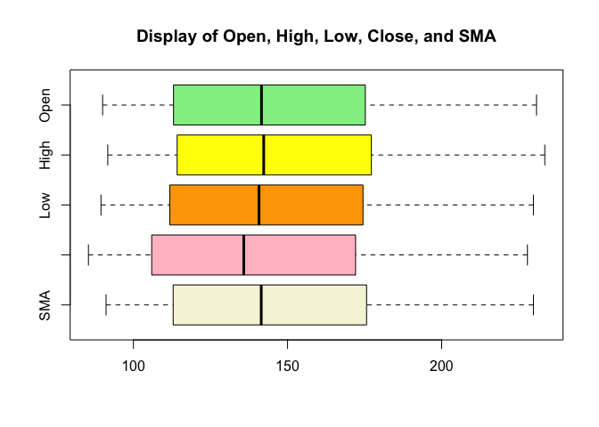
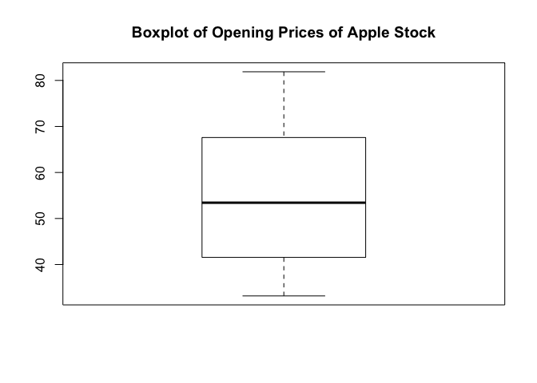
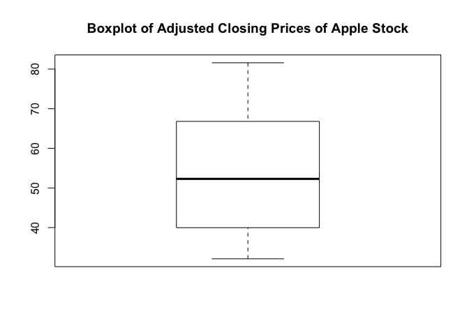
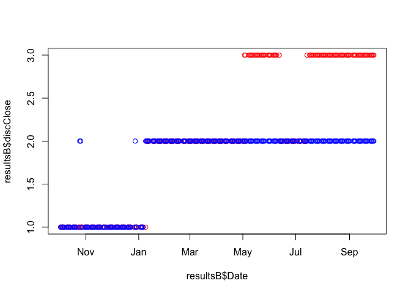

CKME 136 - Capstone
================
Michelle Law
2019-11-03

Load and examine data
---------------------

``` r
aapl <- read.csv("/Users/michellelaw/Documents/CKME999/8. CKME136 - Capstone Course /AAPL.csv", stringsAsFactors = TRUE)
head(aapl)
```

    ##         Date   Open   High   Low  Close Adj.Close   Volume
    ## 1 2014-10-01 100.59 100.69 98.70  99.18  90.73487 51491300
    ## 2 2014-10-02  99.27 100.22 98.04  99.90  91.39356 47757800
    ## 3 2014-10-03  99.44 100.21 99.04  99.62  91.13739 43469600
    ## 4 2014-10-06  99.95 100.65 99.42  99.62  91.13739 37051200
    ## 5 2014-10-07  99.43 100.12 98.73  98.75  90.34148 42094200
    ## 6 2014-10-08  98.76 101.11 98.31 100.80  92.21692 57404700

``` r
str(aapl)
```

    ## 'data.frame':    1258 obs. of  7 variables:
    ##  $ Date     : Factor w/ 1258 levels "2014-10-01","2014-10-02",..: 1 2 3 4 5 6 7 8 9 10 ...
    ##  $ Open     : num  100.6 99.3 99.4 99.9 99.4 ...
    ##  $ High     : num  101 100 100 101 100 ...
    ##  $ Low      : num  98.7 98 99 99.4 98.7 ...
    ##  $ Close    : num  99.2 99.9 99.6 99.6 98.8 ...
    ##  $ Adj.Close: num  90.7 91.4 91.1 91.1 90.3 ...
    ##  $ Volume   : int  51491300 47757800 43469600 37051200 42094200 57404700 77376500 66331600 53583400 63688600 ...

``` r
summary(aapl)
```

    ##          Date           Open            High             Low        
    ##  2014-10-01:   1   Min.   : 90.0   Min.   : 91.67   Min.   : 89.47  
    ##  2014-10-02:   1   1st Qu.:113.0   1st Qu.:114.18   1st Qu.:111.82  
    ##  2014-10-03:   1   Median :141.6   Median :142.26   Median :140.74  
    ##  2014-10-06:   1   Mean   :146.9   Mean   :148.19   Mean   :145.59  
    ##  2014-10-07:   1   3rd Qu.:175.2   3rd Qu.:177.18   3rd Qu.:174.48  
    ##  2014-10-08:   1   Max.   :230.8   Max.   :233.47   Max.   :229.78  
    ##  (Other)   :1252                                                    
    ##      Close          Adj.Close         Volume         
    ##  Min.   : 90.34   Min.   : 85.4   Min.   : 11362000  
    ##  1st Qu.:113.01   1st Qu.:105.9   1st Qu.: 24553725  
    ##  Median :141.55   Median :135.8   Median : 32483250  
    ##  Mean   :146.92   Mean   :141.5   Mean   : 37172119  
    ##  3rd Qu.:175.75   3rd Qu.:172.1   3rd Qu.: 44975725  
    ##  Max.   :232.07   Max.   :227.8   Max.   :162206300  
    ## 

Converting to date format
-------------------------

``` r
aapl$Date <- as.Date(aapl$Date, "%Y-%m-%d")
head(aapl$Date)
```

    ## [1] "2014-10-01" "2014-10-02" "2014-10-03" "2014-10-06" "2014-10-07"
    ## [6] "2014-10-08"

Install relevant packages
-------------------------

``` r
#install.packages("quantmod")
library(quantmod)
```

    ## Loading required package: xts

    ## Loading required package: zoo

    ## 
    ## Attaching package: 'zoo'

    ## The following objects are masked from 'package:base':
    ## 
    ##     as.Date, as.Date.numeric

    ## Loading required package: TTR

    ## Version 0.4-0 included new data defaults. See ?getSymbols.

``` r
#install.packages("arules")
library(arules)
```

    ## Loading required package: Matrix

    ## 
    ## Attaching package: 'arules'

    ## The following objects are masked from 'package:base':
    ## 
    ##     abbreviate, write

``` r
#install.packages("randomForest")
library(randomForest)
```

    ## randomForest 4.6-14

    ## Type rfNews() to see new features/changes/bug fixes.

``` r
#install.packages("caret")
library(caret)
```

    ## Loading required package: lattice

    ## Loading required package: ggplot2

    ## 
    ## Attaching package: 'ggplot2'

    ## The following object is masked from 'package:randomForest':
    ## 
    ##     margin

``` r
#install.packages("nnet")
library(nnet)
#install.packages("e1071")
library(e1071)
```

Adding attributes to dataset
----------------------------

``` r
## Adding attribute that indicates change from previous day
aapl$DiffClose <- momentum(aapl$Close, n = 1)

## Adding Simple Moving Attribute as an attribute
aapl$SMA <- SMA(aapl$Close, n = 3)

## Adding MACD as an attribute. If MACD goes above the signal line we long, if it goes below the signal line we short.
macd <- MACD(aapl$Close, nFast=12, nSlow=26,nSig=9,maType="SMA", percent = FALSE)
aapl <- data.frame(aapl, macd)

## Adding Exponential Moving Average as an attribute
aapl$EMA <- EMA(aapl$Close, n = 3)

## Adding Momentum as an attribute
aapl$momentum <- momentum(aapl$Close, n = 3)

## Adding RSI as an attribute
aapl$RSI <- RSI(aapl$Close, n = 7)

## Adding Bollinger Band as an attribute
BB <- BBands(aapl[,c("High", "Low", "Close")], n = 3, s.d = 2)
aapl <- data.frame(aapl, BB)

head(aapl)
```

    ##         Date   Open   High   Low  Close Adj.Close   Volume DiffClose
    ## 1 2014-10-01 100.59 100.69 98.70  99.18  90.73487 51491300        NA
    ## 2 2014-10-02  99.27 100.22 98.04  99.90  91.39356 47757800  0.720002
    ## 3 2014-10-03  99.44 100.21 99.04  99.62  91.13739 43469600 -0.279999
    ## 4 2014-10-06  99.95 100.65 99.42  99.62  91.13739 37051200  0.000000
    ## 5 2014-10-07  99.43 100.12 98.73  98.75  90.34148 42094200 -0.870003
    ## 6 2014-10-08  98.76 101.11 98.31 100.80  92.21692 57404700  2.050003
    ##        SMA macd signal      EMA  momentum RSI       dn     mavg        up
    ## 1       NA   NA     NA       NA        NA  NA       NA       NA        NA
    ## 2       NA   NA     NA       NA        NA  NA       NA       NA        NA
    ## 3 99.56667   NA     NA 99.56667        NA  NA 99.31710 99.51111  99.70512
    ## 4 99.71334   NA     NA 99.59334  0.440003  NA 99.21879 99.63556 100.05233
    ## 5 99.33000   NA     NA 99.17167 -1.150002  NA 99.00013 99.57333 100.14654
    ## 6 99.72334   NA     NA 99.98584  1.180000  NA 98.96930 99.72333 100.47736
    ##        pctB
    ## 1        NA
    ## 2        NA
    ## 3 0.7892205
    ## 4 0.8132543
    ## 5 0.1743453
    ## 6 0.7320859

``` r
str(aapl)
```

    ## 'data.frame':    1258 obs. of  18 variables:
    ##  $ Date     : Date, format: "2014-10-01" "2014-10-02" ...
    ##  $ Open     : num  100.6 99.3 99.4 99.9 99.4 ...
    ##  $ High     : num  101 100 100 101 100 ...
    ##  $ Low      : num  98.7 98 99 99.4 98.7 ...
    ##  $ Close    : num  99.2 99.9 99.6 99.6 98.8 ...
    ##  $ Adj.Close: num  90.7 91.4 91.1 91.1 90.3 ...
    ##  $ Volume   : int  51491300 47757800 43469600 37051200 42094200 57404700 77376500 66331600 53583400 63688600 ...
    ##  $ DiffClose: num  NA 0.72 -0.28 0 -0.87 ...
    ##  $ SMA      : num  NA NA 99.6 99.7 99.3 ...
    ##  $ macd     : num  NA NA NA NA NA NA NA NA NA NA ...
    ##  $ signal   : num  NA NA NA NA NA NA NA NA NA NA ...
    ##  $ EMA      : num  NA NA 99.6 99.6 99.2 ...
    ##  $ momentum : num  NA NA NA 0.44 -1.15 ...
    ##  $ RSI      : num  NA NA NA NA NA ...
    ##  $ dn       : num  NA NA 99.3 99.2 99 ...
    ##  $ mavg     : num  NA NA 99.5 99.6 99.6 ...
    ##  $ up       : num  NA NA 99.7 100.1 100.1 ...
    ##  $ pctB     : num  NA NA 0.789 0.813 0.174 ...

``` r
summary(aapl)
```

    ##       Date                 Open            High             Low        
    ##  Min.   :2014-10-01   Min.   : 90.0   Min.   : 91.67   Min.   : 89.47  
    ##  1st Qu.:2015-12-30   1st Qu.:113.0   1st Qu.:114.18   1st Qu.:111.82  
    ##  Median :2017-03-30   Median :141.6   Median :142.26   Median :140.74  
    ##  Mean   :2017-03-31   Mean   :146.9   Mean   :148.19   Mean   :145.59  
    ##  3rd Qu.:2018-06-28   3rd Qu.:175.2   3rd Qu.:177.18   3rd Qu.:174.48  
    ##  Max.   :2019-09-30   Max.   :230.8   Max.   :233.47   Max.   :229.78  
    ##                                                                        
    ##      Close          Adj.Close         Volume            DiffClose        
    ##  Min.   : 90.34   Min.   : 85.4   Min.   : 11362000   Min.   :-15.73000  
    ##  1st Qu.:113.01   1st Qu.:105.9   1st Qu.: 24553725   1st Qu.: -0.88001  
    ##  Median :141.55   Median :135.8   Median : 32483250   Median :  0.08000  
    ##  Mean   :146.92   Mean   :141.5   Mean   : 37172119   Mean   :  0.09928  
    ##  3rd Qu.:175.75   3rd Qu.:172.1   3rd Qu.: 44975725   3rd Qu.:  1.30000  
    ##  Max.   :232.07   Max.   :227.8   Max.   :162206300   Max.   : 11.21001  
    ##                                                       NA's   :1          
    ##       SMA              macd              signal              EMA        
    ##  Min.   : 91.12   Min.   :-15.7615   Min.   :-14.4709   Min.   : 91.06  
    ##  1st Qu.:112.97   1st Qu.: -1.3118   1st Qu.: -1.2242   1st Qu.:112.97  
    ##  Median :141.53   Median :  1.0379   Median :  0.9380   Median :141.74  
    ##  Mean   :146.90   Mean   :  0.6575   Mean   :  0.6306   Mean   :146.90  
    ##  3rd Qu.:175.65   3rd Qu.:  3.1117   3rd Qu.:  3.0123   3rd Qu.:175.85  
    ##  Max.   :229.78   Max.   :  9.3170   Max.   :  8.5609   Max.   :229.80  
    ##  NA's   :2        NA's   :25         NA's   :33         NA's   :2       
    ##     momentum            RSI               dn              mavg       
    ##  Min.   :-19.700   Min.   : 7.772   Min.   : 89.26   Min.   : 91.48  
    ##  1st Qu.: -1.640   1st Qu.:41.559   1st Qu.:111.63   1st Qu.:113.01  
    ##  Median :  0.420   Median :55.865   Median :140.71   Median :141.56  
    ##  Mean   :  0.290   Mean   :55.331   Mean   :144.73   Mean   :146.88  
    ##  3rd Qu.:  2.475   3rd Qu.:70.047   3rd Qu.:173.50   3rd Qu.:175.40  
    ##  Max.   : 17.700   Max.   :94.046   Max.   :227.02   Max.   :229.81  
    ##  NA's   :3         NA's   :7        NA's   :2        NA's   :2       
    ##        up              pctB       
    ##  Min.   : 93.16   Min.   :0.1464  
    ##  1st Qu.:114.77   1st Qu.:0.2283  
    ##  Median :142.13   Median :0.6197  
    ##  Mean   :149.03   Mean   :0.5325  
    ##  3rd Qu.:178.98   3rd Qu.:0.7915  
    ##  Max.   :234.47   Max.   :0.8536  
    ##  NA's   :2        NA's   :2

Since I am trying to predict the closing price, I will have to use the previous day's complete data because High, Low, Adj. Close and all the technical indicators will only be availble after the day has ended. I will lag the attributes used in the prediction by 1 day.
----------------------------------------------------------------------------------------------------------------------------------------------------------------------------------------------------------------------------------------------------------------------------

``` r
u <- rbind(NA, aapl[,3:18])
i <- aapl[1:2]

aapl <- cbind(i, u[1:1258,])
```

Check for any missing values and replace
========================================

``` r
sum(is.na(aapl[1:2]))
```

    ## [1] 0

``` r
## For the attributes High, Low, Close, Adj. Close and Volume, I investigated the mean and median for the entire data set and for just the first year but both values were an inaccurate representation for that period in time. Therefore, I replaced the NA values with the next day's value.
hist(aapl$High[1:64])
```



``` r
median(aapl$High[1:64], na.rm = TRUE)
```

    ## [1] 110.3

``` r
aapl$High[1] <- aapl$High[2]

hist(aapl$Low[1:64])
```


``` r
median(aapl$Low[1:64], na.rm = TRUE)
```

    ## [1] 108.55

``` r
aapl$Low[1] <- aapl$Low[2]

hist(aapl$Close[1:64])
```


``` r
median(aapl$Close[1:64], na.rm = TRUE)
```

    ## [1] 109.41

``` r
aapl$Close[1] <- aapl$Close[2]

hist(aapl$Adj.Close[1:64])
```


``` r
median(aapl$Adj.Close[1:64], na.rm = TRUE)
```

    ## [1] 100.5278

``` r
aapl$Adj.Close[1] <- aapl$Adj.Close[2]

hist(aapl$Volume[1:64])
```


``` r
median(aapl$Volume[1:64], na.rm = TRUE)
```

    ## [1] 47053900

``` r
aapl$Volume[1] <- aapl$Volume[2]

sum(is.na(aapl$DiffClose))
```

    ## [1] 2

``` r
hist(aapl$DiffClose)
```


``` r
mean(aapl$DiffClose, na.rm = TRUE)
```

    ## [1] 0.09525478

``` r
## Since this indicates the difference in closing price, it will just indicate 0 for the first row.
aapl$DiffClose[1:2] <- 0

sum(is.na(aapl$SMA))
```

    ## [1] 3

``` r
hist(aapl$SMA[1:64])
```


``` r
## Since the simple moving average takes into account the prices from a window of 3 days, I decided to replace the first two missing attributes with the average of the prices of the first 3 days of real data.
aapl$SMA[1:3] <- mean(aapl$Close[2:4])

sum(is.na(aapl$macd))
```

    ## [1] 26

``` r
hist(aapl$macd)
```


``` r
aapl$macd[1:26] <- median(aapl$macd, na.rm = TRUE)

sum(is.na(aapl$signal))
```

    ## [1] 34

``` r
hist(aapl$signal)
```



``` r
aapl$signal[1:34] <- median(aapl$signal, na.rm = TRUE)

sum(is.na(aapl$EMA))
```

    ## [1] 3

``` r
hist(aapl$EMA)
```


``` r
aapl$EMA[1:3] <- mean(aapl$Close[2:4])

sum(is.na(aapl$momentum))
```

    ## [1] 4

``` r
hist(aapl$momentum)
```


``` r
aapl$momentum[1:4] <- mean(aapl$momentum, na.rm = TRUE)


sum(is.na(aapl$RSI))
```

    ## [1] 8

``` r
hist(aapl$RSI)
```


``` r
aapl$RSI[1:8] <- median(aapl$RSI, na.rm = TRUE)

sum(is.na(aapl$dn))
```

    ## [1] 3

``` r
hist(aapl$dn)
```



``` r
aapl$dn[1:3] <- aapl$dn[4]

sum(is.na(aapl$mavg))
```

    ## [1] 3

``` r
hist(aapl$dn)
```


``` r
aapl$mavg[1:3] <- aapl$mavg[4]

sum(is.na(aapl$up))
```

    ## [1] 3

``` r
hist(aapl$up)
```


``` r
aapl$up[1:3] <- aapl$up[4]

sum(is.na(aapl$pctB))
```

    ## [1] 3

``` r
hist(aapl$pctB)
```


``` r
aapl$pctB[1:3] <- aapl$pctB[4]

sum(is.na(aapl))
```

    ## [1] 0

Check for correlation between attributes
----------------------------------------

``` r
nodate <- aapl[,2:18]

## Since Volume, DiffClose, and momentum are weak indicators, these attributes will be removed from the analysis. Although MACD (made up of both MACD and signal attributes) show a weak correlation I decided to keep them as research indicates that they are strong indicators.

aapl <- aapl[-7:-8]
aapl <- aapl[-11]
```

Check for percentage outliers of remaining attributes
-----------------------------------------------------

``` r
attach(aapl)
```

    ## The following object is masked _by_ .GlobalEnv:
    ## 
    ##     macd

``` r
summary(aapl)
```

    ##       Date                 Open            High             Low        
    ##  Min.   :2014-10-01   Min.   : 90.0   Min.   : 91.67   Min.   : 89.47  
    ##  1st Qu.:2015-12-30   1st Qu.:113.0   1st Qu.:114.17   1st Qu.:111.80  
    ##  Median :2017-03-30   Median :141.6   Median :142.09   Median :140.62  
    ##  Mean   :2017-03-31   Mean   :146.9   Mean   :148.09   Mean   :145.49  
    ##  3rd Qu.:2018-06-28   3rd Qu.:175.2   3rd Qu.:177.04   3rd Qu.:174.41  
    ##  Max.   :2019-09-30   Max.   :230.8   Max.   :233.47   Max.   :229.78  
    ##      Close          Adj.Close          SMA              macd         
    ##  Min.   : 90.34   Min.   : 85.4   Min.   : 91.12   Min.   :-15.7615  
    ##  1st Qu.:112.98   1st Qu.:105.9   1st Qu.:112.87   1st Qu.: -1.2738  
    ##  Median :141.44   Median :135.7   Median :141.40   Median :  1.0232  
    ##  Mean   :146.82   Mean   :141.3   Mean   :146.73   Mean   :  0.6617  
    ##  3rd Qu.:175.52   3rd Qu.:172.0   3rd Qu.:175.59   3rd Qu.:  3.0558  
    ##  Max.   :232.07   Max.   :227.8   Max.   :229.78   Max.   :  9.3170  
    ##      signal              EMA              RSI               dn        
    ##  Min.   :-14.4709   Min.   : 91.06   Min.   : 7.772   Min.   : 89.26  
    ##  1st Qu.: -1.1639   1st Qu.:112.95   1st Qu.:41.646   1st Qu.:111.40  
    ##  Median :  0.9376   Median :141.53   Median :55.820   Median :140.64  
    ##  Mean   :  0.6350   Mean   :146.73   Mean   :55.326   Mean   :144.56  
    ##  3rd Qu.:  2.9205   3rd Qu.:175.69   3rd Qu.:69.968   3rd Qu.:173.48  
    ##  Max.   :  8.5609   Max.   :229.80   Max.   :94.046   Max.   :227.02  
    ##       mavg              up              pctB       
    ##  Min.   : 91.48   Min.   : 93.16   Min.   :0.1464  
    ##  1st Qu.:112.85   1st Qu.:114.58   1st Qu.:0.2293  
    ##  Median :141.41   Median :141.73   Median :0.6215  
    ##  Mean   :146.71   Mean   :148.85   Mean   :0.5328  
    ##  3rd Qu.:175.26   3rd Qu.:178.85   3rd Qu.:0.7910  
    ##  Max.   :229.81   Max.   :234.47   Max.   :0.8536

``` r
boxplot(Open, main = "Boxplot of Opening Prices of Apple Stock")
```


``` r
boxplot(High, main = "Boxplot of High Prices of Apple Stock")
```


``` r
boxplot(Low, main = "Boxplot of Low Prices of Apple Stock")
```


``` r
boxplot(Close, main = "Boxplot of Closing Prices of Apple Stock")
```


``` r
boxplot(Adj.Close, main = "Boxplot of Adjusted Closing Prices of Apple Stock")
```


``` r
boxplot(SMA, main = "Boxplot of Simple Moving Average of Apple Stock")
```


``` r
boxplot(macd, main = "Boxplot of Moving Average Convergence Divergence")
```


``` r
boxplot(EMA, main = "Boxplot of Exponential Moving Average of Apple Stock")
```


``` r
boxplot(RSI, main = "Boxplot of Relative Strength Index of Apple Stock")
```


``` r
boxplot(BB, main = "Boxplot of Bollinger Band")
```


``` r
boxplot(pctB, main = "Boxplot of %B calculation in Bollinger Band of Apple Stock")
```


Visualize closing price and simple moving average
-------------------------------------------------

``` r
aaplxts <- xts(aapl$Close, aapl$Date)
chartSeries(aaplxts, TA = "addSMA()", theme = "white")
```


Visualize closing price and exponential moving average
------------------------------------------------------

``` r
chartSeries(aaplxts, TA = "addEMA()", theme = "white")
```


Visualize closing price and moving average convergence divergence
-----------------------------------------------------------------

``` r
chartSeries(aaplxts, TA = "addMACD()", theme = "white")
```

 \#\# Visualize closing price and bollingers band

``` r
chartSeries(aaplxts, TA = "addBBands()", theme = "white")
```


Discretize Data and attach to data frame
----------------------------------------

``` r
aapldisc <- discretizeDF(aapl, method = list(Close = list(method = "interval", breaks = 5)), default = list(method = "interval"))
summary(aapldisc)
```

    ##       Date                   Open             High             Low     
    ##  Min.   :2014-10-01   [90,137) :604   [91.7,139):609   [89.5,136):605  
    ##  1st Qu.:2015-12-30   [137,184):389   [139,186) :388   [136,183) :394  
    ##  Median :2017-03-30   [184,231]:265   [186,233] :261   [183,230] :259  
    ##  Mean   :2017-03-31                                                    
    ##  3rd Qu.:2018-06-28                                                    
    ##  Max.   :2019-09-30                                                    
    ##         Close          Adj.Close           SMA                macd    
    ##  [90.3,119):431   [85.4,133):608   [91.1,137):608   [-15.8,-7.4): 49  
    ##  [119,147) :245   [133,180) :384   [137,184) :385   [-7.4,0.957):559  
    ##  [147,175) :266   [180,228] :266   [184,230] :265   [0.957,9.32]:650  
    ##  [175,204) :190                                                       
    ##  [204,232] :126                                                       
    ##                                                                       
    ##            signal            EMA               RSI               dn     
    ##  [-14.5,-6.79): 54   [91.1,137):608   [7.77,36.5):209   [89.3,135):602  
    ##  [-6.79,0.884):547   [137,184) :386   [36.5,65.3):643   [135,181) :398  
    ##  [0.884,8.56] :657   [184,230] :264   [65.3,94]  :406   [181,227] :258  
    ##                                                                         
    ##                                                                         
    ##                                                                         
    ##          mavg              up                 pctB    
    ##  [91.5,138):608   [93.2,140):617   [0.146,0.382):469  
    ##  [138,184) :385   [140,187) :384   [0.382,0.618):158  
    ##  [184,230] :265   [187,234] :257   [0.618,0.854]:631  
    ##                                                       
    ##                                                       
    ## 

``` r
aapl$discClose <- aapldisc$Close
table(aapl$discClose)
```

    ## 
    ## [90.3,119)  [119,147)  [147,175)  [175,204)  [204,232] 
    ##        431        245        266        190        126

Split data into training and test set
-------------------------------------

``` r
## The 1st year will be taken and tested on the 2nd year, then the 2nd year will be added to the first year and tested on the 3rd and so on. The year periods run from the first business day in October to the last business day in September of the following year.
trainaaplA <- aapl[1:252,]
trainaaplB <- aapl[1:505,]
trainaaplC <- aapl[1:756,]
trainaaplD <- aapl[1:1007,]

table(aapl$discClose[1:252])
```

    ## 
    ## [90.3,119)  [119,147)  [147,175)  [175,204)  [204,232] 
    ##        124        128          0          0          0

``` r
trainaaplA$discClose <- droplevels(trainaaplA$discClose)
trainaaplB$discClose <- droplevels(trainaaplB$discClose)
trainaaplC$discClose <- droplevels(trainaaplC$discClose)
trainaaplD$discClose <- droplevels(trainaaplD$discClose)

## Remove predictive class from test set as well
testaaplA <- aapl[253:505, -16]
testaaplB <- aapl[506:756, -16]
testaaplC <- aapl[757:1007, -16]
testaaplD <- aapl[1008:1258, -16]
```

Logistic Regression
-------------------

``` r
class(aapl$discClose)
```

    ## [1] "factor"

``` r
aapllogitA <- multinom(discClose ~ ., data = trainaaplA)
```

    ## # weights:  17 (16 variable)
    ## initial  value 174.673090 
    ## iter  10 value 1.820912
    ## iter  20 value 1.318866
    ## iter  30 value 0.976811
    ## iter  40 value 0.130764
    ## iter  50 value 0.000447
    ## final  value 0.000055 
    ## converged

``` r
summary(aapllogitA)
```

    ## Call:
    ## multinom(formula = discClose ~ ., data = trainaaplA)
    ## 
    ## Coefficients:
    ##                 Values   Std. Err.
    ## (Intercept)  0.3216303  0.03054585
    ## Date        -0.4171493  0.90827432
    ## Open         6.5662170  3.90228464
    ## High        -0.3018517  7.33484163
    ## Low         17.9243379 16.84638552
    ## Close       10.7039188  3.66247991
    ## Adj.Close   31.2606208  0.25667226
    ## SMA         -4.3979842 17.64755130
    ## macd         2.1214954 20.54258930
    ## signal      -0.9137135 12.18695526
    ## EMA         -9.9863511 14.93941191
    ## RSI         -1.2374766  5.53201849
    ## dn          -4.9483460 35.06985378
    ## mavg         3.0722844 20.63383609
    ## up          11.0929148  6.20099728
    ## pctB         4.8263893  0.90224145
    ## 
    ## Residual Deviance: 0.0001105901 
    ## AIC: 30.00011

``` r
predictaaplA <- predict(aapllogitA, testaaplA)

resultsA <- aapl[253:505,]
resultsA <- data.frame(resultsA, predictaaplA)
plot(resultsA$Date, resultsA$discClose, type = "p", col = "Red")
lines(resultsA$Date, resultsA$predictaaplA, type = "p", col = "Blue")
```


``` r
confusionMatrix(resultsA$predictaaplA, resultsA$discClose, mode = "prec_recall")
```

    ## Warning in levels(reference) != levels(data): longer object length is not a
    ## multiple of shorter object length

    ## Warning in confusionMatrix.default(resultsA$predictaaplA,
    ## resultsA$discClose, : Levels are not in the same order for reference and
    ## data. Refactoring data to match.

    ## Confusion Matrix and Statistics
    ## 
    ##             Reference
    ## Prediction   [90.3,119) [119,147) [147,175) [175,204) [204,232]
    ##   [90.3,119)        239         6         0         0         0
    ##   [119,147)           0         8         0         0         0
    ##   [147,175)           0         0         0         0         0
    ##   [175,204)           0         0         0         0         0
    ##   [204,232]           0         0         0         0         0
    ## 
    ## Overall Statistics
    ##                                           
    ##                Accuracy : 0.9763          
    ##                  95% CI : (0.9491, 0.9912)
    ##     No Information Rate : 0.9447          
    ##     P-Value [Acc > NIR] : 0.01235         
    ##                                           
    ##                   Kappa : 0.7158          
    ##                                           
    ##  Mcnemar's Test P-Value : NA              
    ## 
    ## Statistics by Class:
    ## 
    ##                      Class: [90.3,119) Class: [119,147) Class: [147,175)
    ## Precision                       0.9755          1.00000               NA
    ## Recall                          1.0000          0.57143               NA
    ## F1                              0.9876          0.72727               NA
    ## Prevalence                      0.9447          0.05534                0
    ## Detection Rate                  0.9447          0.03162                0
    ## Detection Prevalence            0.9684          0.03162                0
    ## Balanced Accuracy               0.7857          0.78571               NA
    ##                      Class: [175,204) Class: [204,232]
    ## Precision                          NA               NA
    ## Recall                             NA               NA
    ## F1                                 NA               NA
    ## Prevalence                          0                0
    ## Detection Rate                      0                0
    ## Detection Prevalence                0                0
    ## Balanced Accuracy                  NA               NA

``` r
mean(c(.9755, 1))#Precision
```

    ## [1] 0.98775

``` r
mean(c(1, 0.57143)) #Recall
```

    ## [1] 0.785715

``` r
mean(c(.9876, .72727)) #Fmeasure
```

    ## [1] 0.857435

``` r
class(aapl$discClose)
```

    ## [1] "factor"

``` r
aapllogitB <- multinom(discClose ~ ., data = trainaaplB)
```

    ## # weights:  17 (16 variable)
    ## initial  value 350.039326 
    ## iter  10 value 88.814058
    ## iter  20 value 11.891843
    ## iter  30 value 2.125147
    ## iter  40 value 0.140702
    ## iter  50 value 0.025975
    ## iter  60 value 0.019255
    ## iter  70 value 0.010126
    ## iter  80 value 0.007820
    ## iter  90 value 0.005065
    ## iter 100 value 0.003156
    ## final  value 0.003156 
    ## stopped after 100 iterations

``` r
summary(aapllogitB)
```

    ## Call:
    ## multinom(formula = discClose ~ ., data = trainaaplB)
    ## 
    ## Coefficients:
    ##                  Values   Std. Err.
    ## (Intercept) -40.4655203 0.003581483
    ## Date         -0.2555486 0.075710416
    ## Open          3.9931010 0.591593068
    ## High         -3.3260058 0.538753081
    ## Low          -1.0745287 1.291259858
    ## Close       -17.2011498 0.473485671
    ## Adj.Close    59.5751990 0.201346596
    ## SMA         -21.5030014 1.671548439
    ## macd          8.9514096 1.020492052
    ## signal       -6.6083326 1.210040666
    ## EMA           1.2160912 1.333364478
    ## RSI          -0.3459215 1.810001579
    ## dn            5.7460269 3.441018798
    ## mavg          6.3232948 1.786131433
    ## up            6.9005626 0.141969853
    ## pctB         -6.0693032 0.045516875
    ## 
    ## Residual Deviance: 0.006312823 
    ## AIC: 30.00631

``` r
predictaaplB <- predict(aapllogitB, testaaplB)
(predictaaplB)
```

    ##   [1] [90.3,119) [90.3,119) [90.3,119) [90.3,119) [90.3,119) [90.3,119)
    ##   [7] [90.3,119) [90.3,119) [90.3,119) [90.3,119) [90.3,119) [90.3,119)
    ##  [13] [90.3,119) [90.3,119) [90.3,119) [90.3,119) [119,147)  [119,147) 
    ##  [19] [90.3,119) [90.3,119) [90.3,119) [90.3,119) [90.3,119) [90.3,119)
    ##  [25] [90.3,119) [90.3,119) [90.3,119) [90.3,119) [90.3,119) [90.3,119)
    ##  [31] [90.3,119) [90.3,119) [90.3,119) [90.3,119) [90.3,119) [90.3,119)
    ##  [37] [90.3,119) [90.3,119) [90.3,119) [90.3,119) [90.3,119) [90.3,119)
    ##  [43] [90.3,119) [90.3,119) [90.3,119) [90.3,119) [90.3,119) [90.3,119)
    ##  [49] [90.3,119) [90.3,119) [90.3,119) [90.3,119) [90.3,119) [90.3,119)
    ##  [55] [90.3,119) [90.3,119) [90.3,119) [90.3,119) [90.3,119) [90.3,119)
    ##  [61] [119,147)  [90.3,119) [90.3,119) [90.3,119) [90.3,119) [90.3,119)
    ##  [67] [90.3,119) [119,147)  [119,147)  [119,147)  [119,147)  [119,147) 
    ##  [73] [119,147)  [119,147)  [119,147)  [119,147)  [119,147)  [119,147) 
    ##  [79] [119,147)  [119,147)  [119,147)  [119,147)  [119,147)  [119,147) 
    ##  [85] [119,147)  [119,147)  [119,147)  [119,147)  [119,147)  [119,147) 
    ##  [91] [119,147)  [119,147)  [119,147)  [119,147)  [119,147)  [119,147) 
    ##  [97] [119,147)  [119,147)  [119,147)  [119,147)  [119,147)  [119,147) 
    ## [103] [119,147)  [119,147)  [119,147)  [119,147)  [119,147)  [119,147) 
    ## [109] [119,147)  [119,147)  [119,147)  [119,147)  [119,147)  [119,147) 
    ## [115] [119,147)  [119,147)  [119,147)  [119,147)  [119,147)  [119,147) 
    ## [121] [119,147)  [119,147)  [119,147)  [119,147)  [119,147)  [119,147) 
    ## [127] [119,147)  [119,147)  [119,147)  [119,147)  [119,147)  [119,147) 
    ## [133] [119,147)  [119,147)  [119,147)  [119,147)  [119,147)  [119,147) 
    ## [139] [119,147)  [119,147)  [119,147)  [119,147)  [119,147)  [119,147) 
    ## [145] [119,147)  [119,147)  [119,147)  [119,147)  [119,147)  [119,147) 
    ## [151] [119,147)  [119,147)  [119,147)  [119,147)  [119,147)  [119,147) 
    ## [157] [119,147)  [119,147)  [119,147)  [119,147)  [119,147)  [119,147) 
    ## [163] [119,147)  [119,147)  [119,147)  [119,147)  [119,147)  [119,147) 
    ## [169] [119,147)  [119,147)  [119,147)  [119,147)  [119,147)  [119,147) 
    ## [175] [119,147)  [119,147)  [119,147)  [119,147)  [119,147)  [119,147) 
    ## [181] [119,147)  [119,147)  [119,147)  [119,147)  [119,147)  [119,147) 
    ## [187] [119,147)  [119,147)  [119,147)  [119,147)  [119,147)  [119,147) 
    ## [193] [119,147)  [119,147)  [119,147)  [119,147)  [119,147)  [119,147) 
    ## [199] [119,147)  [119,147)  [119,147)  [119,147)  [119,147)  [119,147) 
    ## [205] [119,147)  [119,147)  [119,147)  [119,147)  [119,147)  [119,147) 
    ## [211] [119,147)  [119,147)  [119,147)  [119,147)  [119,147)  [119,147) 
    ## [217] [119,147)  [119,147)  [119,147)  [119,147)  [119,147)  [119,147) 
    ## [223] [119,147)  [119,147)  [119,147)  [119,147)  [119,147)  [119,147) 
    ## [229] [119,147)  [119,147)  [119,147)  [119,147)  [119,147)  [119,147) 
    ## [235] [119,147)  [119,147)  [119,147)  [119,147)  [119,147)  [119,147) 
    ## [241] [119,147)  [119,147)  [119,147)  [119,147)  [119,147)  [119,147) 
    ## [247] [119,147)  [119,147)  [119,147)  [119,147)  [119,147) 
    ## Levels: [90.3,119) [119,147)

``` r
resultsB <- aapl[506:756,]
resultsB <- data.frame(resultsB, predictaaplB)
plot(resultsB$Date, resultsB$discClose, type = "p", col = "Red")
lines(resultsB$Date, resultsB$predictaapl, type = "p", col = "Blue")
```



``` r
confusionMatrix(resultsB$predictaapl, resultsB$discClose, mode = "prec_recall")
```

    ## Warning in levels(reference) != levels(data): longer object length is not a
    ## multiple of shorter object length

    ## Warning in confusionMatrix.default(resultsB$predictaapl,
    ## resultsB$discClose, : Levels are not in the same order for reference and
    ## data. Refactoring data to match.

    ## Confusion Matrix and Statistics
    ## 
    ##             Reference
    ## Prediction   [90.3,119) [119,147) [147,175) [175,204) [204,232]
    ##   [90.3,119)         64         0         0         0         0
    ##   [119,147)           4       101        82         0         0
    ##   [147,175)           0         0         0         0         0
    ##   [175,204)           0         0         0         0         0
    ##   [204,232]           0         0         0         0         0
    ## 
    ## Overall Statistics
    ##                                           
    ##                Accuracy : 0.6574          
    ##                  95% CI : (0.5951, 0.7159)
    ##     No Information Rate : 0.4024          
    ##     P-Value [Acc > NIR] : 3.263e-16       
    ##                                           
    ##                   Kappa : 0.4571          
    ##                                           
    ##  Mcnemar's Test P-Value : NA              
    ## 
    ## Statistics by Class:
    ## 
    ##                      Class: [90.3,119) Class: [119,147) Class: [147,175)
    ## Precision                       1.0000           0.5401               NA
    ## Recall                          0.9412           1.0000           0.0000
    ## F1                              0.9697           0.7014               NA
    ## Prevalence                      0.2709           0.4024           0.3267
    ## Detection Rate                  0.2550           0.4024           0.0000
    ## Detection Prevalence            0.2550           0.7450           0.0000
    ## Balanced Accuracy               0.9706           0.7133           0.5000
    ##                      Class: [175,204) Class: [204,232]
    ## Precision                          NA               NA
    ## Recall                             NA               NA
    ## F1                                 NA               NA
    ## Prevalence                          0                0
    ## Detection Rate                      0                0
    ## Detection Prevalence                0                0
    ## Balanced Accuracy                  NA               NA

``` r
mean(c(1, .5401))#Precision
```

    ## [1] 0.77005

``` r
mean(c(1, .9412, 0)) #Recall
```

    ## [1] 0.6470667

``` r
mean(c(.9697, .7014)) #Fmeasure
```

    ## [1] 0.83555

``` r
aapllogitC <- multinom(discClose ~ ., data = trainaaplC)
```

    ## # weights:  51 (32 variable)
    ## initial  value 830.550890 
    ## iter  10 value 217.531625
    ## iter  20 value 116.635495
    ## iter  30 value 36.482829
    ## iter  40 value 14.323045
    ## iter  50 value 0.442313
    ## iter  60 value 0.000847
    ## final  value 0.000047 
    ## converged

``` r
summary(aapllogitC)
```

    ## Call:
    ## multinom(formula = discClose ~ ., data = trainaaplC)
    ## 
    ## Coefficients:
    ##           (Intercept)       Date       Open      High       Low    Close
    ## [119,147)   -337.7535 -0.6491575   1.359496 -50.87197 29.361512 108.2879
    ## [147,175)    292.0825 -1.0227292 -12.248186 -41.52815  9.881463 214.8297
    ##           Adj.Close       SMA     macd    signal       EMA       RSI
    ## [119,147)  135.5820 -204.9096 51.54787 -23.13704 -164.9075 -5.861582
    ## [147,175)  183.6275 -311.4879 97.90026 -48.89931 -316.4639 -8.210660
    ##                  dn      mavg        up       pctB
    ## [119,147)  74.46683  84.36189  94.25694  -93.35449
    ## [147,175) 126.34710 140.98470 155.62231 -228.84737
    ## 
    ## Std. Errors:
    ##           (Intercept)      Date     Open      High       Low     Close
    ## [119,147) 0.031346903 0.3290215 3.114666 3.7644629 4.9019379 3.7513454
    ## [147,175) 0.001082684 0.1409658 0.728021 0.5953442 0.5033953 0.5494233
    ##           Adj.Close       SMA     macd    signal       EMA       RSI
    ## [119,147) 0.1184312 3.5240607 6.204237 0.7951082 3.6435601 28.112422
    ## [147,175) 0.3342127 0.7880686 1.509024 1.1087789 0.6053952  8.858937
    ##                  dn      mavg       up       pctB
    ## [119,147) 4.2461697 3.2274468 2.208724 0.81169652
    ## [147,175) 0.7696344 0.5931632 0.416692 0.03052746
    ## 
    ## Residual Deviance: 9.344223e-05 
    ## AIC: 60.00009

``` r
predictaaplC <- predict(aapllogitC, testaaplC)
(predictaaplC)
```

    ##   [1] [147,175) [147,175) [147,175) [147,175) [147,175) [147,175) [147,175)
    ##   [8] [147,175) [147,175) [147,175) [147,175) [147,175) [147,175) [147,175)
    ##  [15] [147,175) [147,175) [147,175) [147,175) [147,175) [147,175) [147,175)
    ##  [22] [147,175) [147,175) [147,175) [147,175) [147,175) [147,175) [147,175)
    ##  [29] [147,175) [147,175) [147,175) [147,175) [147,175) [147,175) [147,175)
    ##  [36] [147,175) [147,175) [147,175) [147,175) [147,175) [147,175) [147,175)
    ##  [43] [147,175) [147,175) [147,175) [147,175) [147,175) [147,175) [147,175)
    ##  [50] [147,175) [147,175) [147,175) [147,175) [147,175) [147,175) [147,175)
    ##  [57] [147,175) [147,175) [147,175) [147,175) [147,175) [147,175) [147,175)
    ##  [64] [147,175) [147,175) [147,175) [147,175) [147,175) [147,175) [147,175)
    ##  [71] [147,175) [147,175) [147,175) [147,175) [147,175) [147,175) [147,175)
    ##  [78] [147,175) [147,175) [147,175) [147,175) [147,175) [147,175) [147,175)
    ##  [85] [147,175) [147,175) [147,175) [147,175) [147,175) [147,175) [147,175)
    ##  [92] [147,175) [147,175) [147,175) [147,175) [147,175) [147,175) [147,175)
    ##  [99] [147,175) [147,175) [147,175) [147,175) [147,175) [147,175) [147,175)
    ## [106] [147,175) [147,175) [147,175) [147,175) [147,175) [147,175) [147,175)
    ## [113] [147,175) [147,175) [147,175) [147,175) [147,175) [147,175) [147,175)
    ## [120] [147,175) [147,175) [147,175) [147,175) [147,175) [147,175) [147,175)
    ## [127] [147,175) [147,175) [147,175) [147,175) [147,175) [147,175) [147,175)
    ## [134] [147,175) [147,175) [147,175) [147,175) [147,175) [147,175) [147,175)
    ## [141] [147,175) [147,175) [147,175) [147,175) [147,175) [147,175) [147,175)
    ## [148] [147,175) [147,175) [147,175) [147,175) [147,175) [147,175) [147,175)
    ## [155] [147,175) [147,175) [147,175) [147,175) [147,175) [147,175) [147,175)
    ## [162] [147,175) [147,175) [147,175) [147,175) [147,175) [147,175) [147,175)
    ## [169] [147,175) [147,175) [147,175) [147,175) [147,175) [147,175) [147,175)
    ## [176] [147,175) [147,175) [147,175) [147,175) [147,175) [147,175) [147,175)
    ## [183] [147,175) [147,175) [147,175) [147,175) [147,175) [147,175) [147,175)
    ## [190] [147,175) [147,175) [147,175) [147,175) [147,175) [147,175) [147,175)
    ## [197] [147,175) [147,175) [147,175) [147,175) [147,175) [147,175) [147,175)
    ## [204] [147,175) [147,175) [147,175) [147,175) [147,175) [147,175) [147,175)
    ## [211] [147,175) [147,175) [147,175) [147,175) [147,175) [147,175) [147,175)
    ## [218] [147,175) [147,175) [147,175) [147,175) [147,175) [147,175) [147,175)
    ## [225] [147,175) [147,175) [147,175) [147,175) [147,175) [147,175) [147,175)
    ## [232] [147,175) [147,175) [147,175) [147,175) [147,175) [147,175) [147,175)
    ## [239] [147,175) [147,175) [147,175) [147,175) [147,175) [147,175) [147,175)
    ## [246] [147,175) [147,175) [147,175) [147,175) [147,175) [147,175)
    ## Levels: [90.3,119) [119,147) [147,175)

``` r
resultsC <- aapl[757:1007,]
resultsC <- data.frame(resultsC, predictaaplC)
plot(resultsC$Date, resultsC$discClose, type = "p", col = "Red")
lines(resultsC$Date, resultsC$predictaaplC, type = "p", col = "Blue")
```


``` r
confusionMatrix(resultsC$predictaapl, resultsC$discClose, mode = "prec_recall")
```

    ## Warning in levels(reference) != levels(data): longer object length is not a
    ## multiple of shorter object length

    ## Warning in confusionMatrix.default(resultsC$predictaapl,
    ## resultsC$discClose, : Levels are not in the same order for reference and
    ## data. Refactoring data to match.

    ## Confusion Matrix and Statistics
    ## 
    ##             Reference
    ## Prediction   [90.3,119) [119,147) [147,175) [175,204) [204,232]
    ##   [90.3,119)          0         0         0         0         0
    ##   [119,147)           0         0         0         0         0
    ##   [147,175)           0         0       120        91        40
    ##   [175,204)           0         0         0         0         0
    ##   [204,232]           0         0         0         0         0
    ## 
    ## Overall Statistics
    ##                                           
    ##                Accuracy : 0.4781          
    ##                  95% CI : (0.4149, 0.5418)
    ##     No Information Rate : 0.4781          
    ##     P-Value [Acc > NIR] : 0.5248          
    ##                                           
    ##                   Kappa : 0               
    ##                                           
    ##  Mcnemar's Test P-Value : NA              
    ## 
    ## Statistics by Class:
    ## 
    ##                      Class: [90.3,119) Class: [119,147) Class: [147,175)
    ## Precision                           NA               NA           0.4781
    ## Recall                              NA               NA           1.0000
    ## F1                                  NA               NA           0.6469
    ## Prevalence                           0                0           0.4781
    ## Detection Rate                       0                0           0.4781
    ## Detection Prevalence                 0                0           1.0000
    ## Balanced Accuracy                   NA               NA           0.5000
    ##                      Class: [175,204) Class: [204,232]
    ## Precision                          NA               NA
    ## Recall                         0.0000           0.0000
    ## F1                                 NA               NA
    ## Prevalence                     0.3625           0.1594
    ## Detection Rate                 0.0000           0.0000
    ## Detection Prevalence           0.0000           0.0000
    ## Balanced Accuracy              0.5000           0.5000

``` r
mean(c(.4781))#Precision
```

    ## [1] 0.4781

``` r
mean(c(1,0, 0)) #Recall
```

    ## [1] 0.3333333

``` r
mean(c(.6469)) #Fmeasure
```

    ## [1] 0.6469

``` r
aapllogitD <- multinom(discClose ~ ., data = trainaaplD)
```

    ## # weights:  85 (64 variable)
    ## initial  value 1620.703978 
    ## iter  10 value 841.504851
    ## iter  20 value 600.178292
    ## iter  30 value 527.683054
    ## iter  40 value 435.927204
    ## iter  50 value 251.764849
    ## iter  60 value 39.066568
    ## iter  70 value 10.282360
    ## iter  80 value 0.751061
    ## iter  90 value 0.011273
    ## final  value 0.000000 
    ## converged

``` r
summary(aapllogitD)
```

    ## Call:
    ## multinom(formula = discClose ~ ., data = trainaaplD)
    ## 
    ## Coefficients:
    ##           (Intercept)       Date       Open       High         Low
    ## [119,147)  -32037.428  -2.348608  49.164706   44.74208   -6.448556
    ## [147,175)  -15598.004  -5.579257  -6.806552  245.08895 -176.663317
    ## [175,204)    7193.877 -11.036620 151.100221  189.90618  -99.689816
    ## [204,232]   14229.463 -16.220957 181.303533 1180.32761  850.972580
    ##                Close  Adj.Close       SMA      macd     signal        EMA
    ## [119,147)   82.00434   552.5836 -162.4164  111.2303  -65.38228 -238.99982
    ## [147,175)   99.68785   745.7449  655.6623  346.9513 -170.01402  -87.44461
    ## [175,204) -989.28747  1698.5607  689.9689  321.8635 -188.76547  122.59259
    ## [204,232] 3195.74114 -3634.7173 1351.3921 1018.4392 -360.31875 1400.23145
    ##                  RSI        dn      mavg        up      pctB
    ## [119,147)  -1.425376   66.4366  105.7692  145.1017 -109.1700
    ## [147,175)  -9.293567 -236.1406 -188.7122 -141.2839  940.4415
    ## [175,204)  43.161616 -298.9012 -144.1540   10.5932 1391.8233
    ## [204,232] -55.497918 -962.8514 -953.1441 -943.4368  301.5180
    ## 
    ## Std. Errors:
    ##            (Intercept)       Date        Open        High         Low
    ## [119,147) 1.132951e-03 18.9927875 0.135059066 0.135217678 0.132691203
    ## [147,175) 5.260896e-05  0.9194995 0.009188682 0.009219721 0.009132916
    ## [175,204) 5.260896e-05  0.9194995 0.009188682 0.009219721 0.009132916
    ## [204,232] 0.000000e+00  0.0000000 0.000000000 0.000000000 0.000000000
    ##                 Close   Adj.Close         SMA         macd       signal
    ## [119,147) 0.134685190 0.125859606 0.134417061 0.0010469627 0.0013880257
    ## [147,175) 0.009196573 0.008894451 0.009146244 0.0002440251 0.0001533344
    ## [175,204) 0.009196573 0.008894451 0.009146244 0.0002440251 0.0001533344
    ## [204,232] 0.000000000 0.000000000 0.000000000 0.0000000000 0.0000000000
    ##                   EMA         RSI          dn        mavg          up
    ## [119,147) 0.134188699 0.065429146 0.133398401 0.134473708 0.135549015
    ## [147,175) 0.009124826 0.004456696 0.009050682 0.009133501 0.009216321
    ## [175,204) 0.009124826 0.004456696 0.009050682 0.009133501 0.009216321
    ## [204,232] 0.000000000 0.000000000 0.000000000 0.000000000 0.000000000
    ##                   pctB
    ## [119,147) 4.212436e-04
    ## [147,175) 4.204817e-05
    ## [175,204) 4.204817e-05
    ## [204,232] 0.000000e+00
    ## 
    ## Residual Deviance: 1.951708e-09 
    ## AIC: 120

``` r
predictaaplD <- predict(aapllogitD, testaaplD)
(predictaaplD)
```

    ##   [1] [204,232] [204,232] [204,232] [204,232] [204,232] [204,232] [204,232]
    ##   [8] [204,232] [204,232] [175,204) [204,232] [204,232] [204,232] [204,232]
    ##  [15] [204,232] [204,232] [204,232] [175,204) [204,232] [204,232] [204,232]
    ##  [22] [175,204) [175,204) [204,232] [204,232] [175,204) [175,204) [175,204)
    ##  [29] [175,204) [175,204) [175,204) [175,204) [175,204) [175,204) [175,204)
    ##  [36] [175,204) [175,204) [175,204) [175,204) [147,175) [147,175) [147,175)
    ##  [43] [175,204) [175,204) [175,204) [175,204) [175,204) [175,204) [147,175)
    ##  [50] [147,175) [147,175) [147,175) [147,175) [147,175) [147,175) [147,175)
    ##  [57] [147,175) [147,175) [119,147) [119,147) [147,175) [147,175) [147,175)
    ##  [64] [147,175) [147,175) [119,147) [119,147) [119,147) [119,147) [147,175)
    ##  [71] [147,175) [119,147) [119,147) [147,175) [147,175) [147,175) [147,175)
    ##  [78] [147,175) [147,175) [119,147) [147,175) [147,175) [147,175) [147,175)
    ##  [85] [147,175) [147,175) [147,175) [175,204) [175,204) [147,175) [147,175)
    ##  [92] [147,175) [147,175) [147,175) [147,175) [147,175) [147,175) [147,175)
    ##  [99] [147,175) [147,175) [175,204) [175,204) [175,204) [147,175) [175,204)
    ## [106] [175,204) [175,204) [147,175) [147,175) [147,175) [175,204) [175,204)
    ## [113] [175,204) [175,204) [175,204) [175,204) [175,204) [175,204) [175,204)
    ## [120] [175,204) [175,204) [175,204) [175,204) [175,204) [175,204) [175,204)
    ## [127] [175,204) [175,204) [175,204) [175,204) [175,204) [175,204) [175,204)
    ## [134] [175,204) [175,204) [175,204) [175,204) [175,204) [175,204) [175,204)
    ## [141] [175,204) [175,204) [175,204) [175,204) [175,204) [175,204) [175,204)
    ## [148] [175,204) [175,204) [175,204) [175,204) [175,204) [175,204) [175,204)
    ## [155] [175,204) [175,204) [175,204) [175,204) [175,204) [175,204) [175,204)
    ## [162] [175,204) [175,204) [175,204) [175,204) [175,204) [175,204) [147,175)
    ## [169] [147,175) [175,204) [175,204) [175,204) [175,204) [175,204) [175,204)
    ## [176] [175,204) [175,204) [175,204) [175,204) [175,204) [175,204) [175,204)
    ## [183] [175,204) [175,204) [175,204) [175,204) [175,204) [175,204) [175,204)
    ## [190] [175,204) [175,204) [175,204) [175,204) [175,204) [175,204) [175,204)
    ## [197] [175,204) [175,204) [175,204) [175,204) [175,204) [175,204) [175,204)
    ## [204] [175,204) [175,204) [175,204) [175,204) [175,204) [175,204) [175,204)
    ## [211] [175,204) [175,204) [175,204) [175,204) [175,204) [175,204) [175,204)
    ## [218] [175,204) [175,204) [175,204) [175,204) [175,204) [175,204) [175,204)
    ## [225] [175,204) [175,204) [175,204) [175,204) [175,204) [175,204) [175,204)
    ## [232] [175,204) [175,204) [175,204) [175,204) [175,204) [175,204) [175,204)
    ## [239] [175,204) [175,204) [175,204) [175,204) [175,204) [175,204) [175,204)
    ## [246] [175,204) [175,204) [175,204) [175,204) [175,204) [175,204)
    ## Levels: [90.3,119) [119,147) [147,175) [175,204) [204,232]

``` r
resultsD <- aapl[1008:1258,]
resultsD <- data.frame(resultsD, predictaaplD)
plot(resultsD$Date, resultsD$discClose, type = "p", col = "Red")
lines(resultsD$Date, resultsD$predictaaplD, type = "p", col = "Blue")
```


``` r
confusionMatrix(resultsD$predictaapl, resultsD$discClose, mode = "prec_recall")
```

    ## Confusion Matrix and Statistics
    ## 
    ##             Reference
    ## Prediction   [90.3,119) [119,147) [147,175) [175,204) [204,232]
    ##   [90.3,119)          0         0         0         0         0
    ##   [119,147)           0         2         7         0         0
    ##   [147,175)           0         0        50         0         0
    ##   [175,204)           0         0         7        99        65
    ##   [204,232]           0         0         0         0        21
    ## 
    ## Overall Statistics
    ##                                           
    ##                Accuracy : 0.6853          
    ##                  95% CI : (0.6239, 0.7422)
    ##     No Information Rate : 0.3944          
    ##     P-Value [Acc > NIR] : < 2.2e-16       
    ##                                           
    ##                   Kappa : 0.5169          
    ##                                           
    ##  Mcnemar's Test P-Value : NA              
    ## 
    ## Statistics by Class:
    ## 
    ##                      Class: [90.3,119) Class: [119,147) Class: [147,175)
    ## Precision                           NA         0.222222           1.0000
    ## Recall                              NA         1.000000           0.7812
    ## F1                                  NA         0.363636           0.8772
    ## Prevalence                           0         0.007968           0.2550
    ## Detection Rate                       0         0.007968           0.1992
    ## Detection Prevalence                 0         0.035857           0.1992
    ## Balanced Accuracy                   NA         0.985944           0.8906
    ##                      Class: [175,204) Class: [204,232]
    ## Precision                      0.5789          1.00000
    ## Recall                         1.0000          0.24419
    ## F1                             0.7333          0.39252
    ## Prevalence                     0.3944          0.34263
    ## Detection Rate                 0.3944          0.08367
    ## Detection Prevalence           0.6813          0.08367
    ## Balanced Accuracy              0.7632          0.62209

``` r
mean(c(.222222, 1, .5789, 1))#Precision
```

    ## [1] 0.7002805

``` r
mean(c(1,.7812, 1)) #Recall
```

    ## [1] 0.9270667

``` r
mean(c(.363636, .8772, .7333)) #Fmeasure
```

    ## [1] 0.6580453

Random Forest
-------------

``` r
aaplrf5 <- randomForest(discClose ~ ., ntree = 501, data = trainaaplD)
plot(aaplrf5)
```


``` r
## Since this plot shows the error rates going flat at approximately 300 trees, I will use 300 trees in my algorithm

aaplrf3 <- randomForest(discClose ~ ., ntree = 301, data = trainaaplA, na.action = na.omit)

predictaaplrfA <- predict(aaplrf3, testaaplA)
summary(predictaaplrfA)
```

    ## [90.3,119)  [119,147) 
    ##        237         16

``` r
resultsrfA <- aapl[253:505,]
resultsrfA <- data.frame(resultsrfA, predictaaplrfA)
plot(resultsrfA$Date, resultsrfA$discClose, type = "o", col = "Red")
lines(resultsrfA$Date, resultsrfA$predictaaplrfA, type = "p", col = "Blue")
```


``` r
confusionMatrix(resultsrfA$predictaaplrfA, resultsrfA$discClose, mode = "prec_recall")
```

    ## Warning in levels(reference) != levels(data): longer object length is not a
    ## multiple of shorter object length

    ## Warning in confusionMatrix.default(resultsrfA$predictaaplrfA,
    ## resultsrfA$discClose, : Levels are not in the same order for reference and
    ## data. Refactoring data to match.

    ## Confusion Matrix and Statistics
    ## 
    ##             Reference
    ## Prediction   [90.3,119) [119,147) [147,175) [175,204) [204,232]
    ##   [90.3,119)        237         0         0         0         0
    ##   [119,147)           2        14         0         0         0
    ##   [147,175)           0         0         0         0         0
    ##   [175,204)           0         0         0         0         0
    ##   [204,232]           0         0         0         0         0
    ## 
    ## Overall Statistics
    ##                                          
    ##                Accuracy : 0.9921         
    ##                  95% CI : (0.9717, 0.999)
    ##     No Information Rate : 0.9447         
    ##     P-Value [Acc > NIR] : 6.963e-05      
    ##                                          
    ##                   Kappa : 0.9292         
    ##                                          
    ##  Mcnemar's Test P-Value : NA             
    ## 
    ## Statistics by Class:
    ## 
    ##                      Class: [90.3,119) Class: [119,147) Class: [147,175)
    ## Precision                       1.0000          0.87500               NA
    ## Recall                          0.9916          1.00000               NA
    ## F1                              0.9958          0.93333               NA
    ## Prevalence                      0.9447          0.05534                0
    ## Detection Rate                  0.9368          0.05534                0
    ## Detection Prevalence            0.9368          0.06324                0
    ## Balanced Accuracy               0.9958          0.99582               NA
    ##                      Class: [175,204) Class: [204,232]
    ## Precision                          NA               NA
    ## Recall                             NA               NA
    ## F1                                 NA               NA
    ## Prevalence                          0                0
    ## Detection Rate                      0                0
    ## Detection Prevalence                0                0
    ## Balanced Accuracy                  NA               NA

``` r
mean(c(1))#Precision
```

    ## [1] 1

``` r
mean(c(1)) #Recall
```

    ## [1] 1

``` r
mean(c(1)) #Fmeasure)
```

    ## [1] 1

``` r
aaplrf3B <- randomForest(discClose ~ ., ntree = 301, data = trainaaplB, na.action = na.omit)
plot(aaplrf3B)
```


``` r
predictaaplrfB <- predict(aaplrf3B, testaaplB)
summary(predictaaplrfB)
```

    ## [90.3,119)  [119,147) 
    ##         68        183

``` r
resultsrfB <- aapl[506:756,]
resultsrfB <- data.frame(resultsrfB, predictaaplrfB)
plot(resultsrfB$Date, resultsrfB$discClose, type = "o", col = "Red")
lines(resultsrfB$Date, resultsrfB$predictaaplrfB, type = "p", col = "Blue")
```


``` r
confusionMatrix(resultsrfB$predictaaplrfB, resultsrfB$discClose, mode = "prec_recall")
```

    ## Warning in levels(reference) != levels(data): longer object length is not a
    ## multiple of shorter object length

    ## Warning in confusionMatrix.default(resultsrfB$predictaaplrfB,
    ## resultsrfB$discClose, : Levels are not in the same order for reference and
    ## data. Refactoring data to match.

    ## Confusion Matrix and Statistics
    ## 
    ##             Reference
    ## Prediction   [90.3,119) [119,147) [147,175) [175,204) [204,232]
    ##   [90.3,119)         68         0         0         0         0
    ##   [119,147)           0       101        82         0         0
    ##   [147,175)           0         0         0         0         0
    ##   [175,204)           0         0         0         0         0
    ##   [204,232]           0         0         0         0         0
    ## 
    ## Overall Statistics
    ##                                          
    ##                Accuracy : 0.6733         
    ##                  95% CI : (0.6115, 0.731)
    ##     No Information Rate : 0.4024         
    ##     P-Value [Acc > NIR] : < 2.2e-16      
    ##                                          
    ##                   Kappa : 0.4841         
    ##                                          
    ##  Mcnemar's Test P-Value : NA             
    ## 
    ## Statistics by Class:
    ## 
    ##                      Class: [90.3,119) Class: [119,147) Class: [147,175)
    ## Precision                       1.0000           0.5519               NA
    ## Recall                          1.0000           1.0000           0.0000
    ## F1                              1.0000           0.7113               NA
    ## Prevalence                      0.2709           0.4024           0.3267
    ## Detection Rate                  0.2709           0.4024           0.0000
    ## Detection Prevalence            0.2709           0.7291           0.0000
    ## Balanced Accuracy               1.0000           0.7267           0.5000
    ##                      Class: [175,204) Class: [204,232]
    ## Precision                          NA               NA
    ## Recall                             NA               NA
    ## F1                                 NA               NA
    ## Prevalence                          0                0
    ## Detection Rate                      0                0
    ## Detection Prevalence                0                0
    ## Balanced Accuracy                  NA               NA

``` r
mean(c(1, .5519))#Precision
```

    ## [1] 0.77595

``` r
mean(c(1, 0, 1)) #Recall
```

    ## [1] 0.6666667

``` r
mean(c(1, .7113)) #Fmeasure)
```

    ## [1] 0.85565

``` r
aaplrf3C <- randomForest(discClose ~ ., ntree = 301, data = trainaaplC)
plot(aaplrf3C)
```


``` r
predictaaplrfC <- predict(aaplrf3C, testaaplC)
summary(predictaaplrfC)
```

    ## [90.3,119)  [119,147)  [147,175) 
    ##          0          0        251

``` r
resultsrfC <- aapl[757:1007,]
resultsrfC <- data.frame(resultsrfC, predictaaplrfC)
plot(resultsrfC$Date, resultsrfC$discClose, type = "o", col = "Red")
lines(resultsrfC$Date, resultsrfC$predictaaplrfC, type = "p", col = "Blue")
```


``` r
confusionMatrix(resultsrfC$predictaaplrfC, resultsrfC$discClose, mode = "prec_recall")
```

    ## Warning in levels(reference) != levels(data): longer object length is not a
    ## multiple of shorter object length

    ## Warning in confusionMatrix.default(resultsrfC$predictaaplrfC,
    ## resultsrfC$discClose, : Levels are not in the same order for reference and
    ## data. Refactoring data to match.

    ## Confusion Matrix and Statistics
    ## 
    ##             Reference
    ## Prediction   [90.3,119) [119,147) [147,175) [175,204) [204,232]
    ##   [90.3,119)          0         0         0         0         0
    ##   [119,147)           0         0         0         0         0
    ##   [147,175)           0         0       120        91        40
    ##   [175,204)           0         0         0         0         0
    ##   [204,232]           0         0         0         0         0
    ## 
    ## Overall Statistics
    ##                                           
    ##                Accuracy : 0.4781          
    ##                  95% CI : (0.4149, 0.5418)
    ##     No Information Rate : 0.4781          
    ##     P-Value [Acc > NIR] : 0.5248          
    ##                                           
    ##                   Kappa : 0               
    ##                                           
    ##  Mcnemar's Test P-Value : NA              
    ## 
    ## Statistics by Class:
    ## 
    ##                      Class: [90.3,119) Class: [119,147) Class: [147,175)
    ## Precision                           NA               NA           0.4781
    ## Recall                              NA               NA           1.0000
    ## F1                                  NA               NA           0.6469
    ## Prevalence                           0                0           0.4781
    ## Detection Rate                       0                0           0.4781
    ## Detection Prevalence                 0                0           1.0000
    ## Balanced Accuracy                   NA               NA           0.5000
    ##                      Class: [175,204) Class: [204,232]
    ## Precision                          NA               NA
    ## Recall                         0.0000           0.0000
    ## F1                                 NA               NA
    ## Prevalence                     0.3625           0.1594
    ## Detection Rate                 0.0000           0.0000
    ## Detection Prevalence           0.0000           0.0000
    ## Balanced Accuracy              0.5000           0.5000

``` r
mean(c(.4781))#Precision
```

    ## [1] 0.4781

``` r
mean(c(1, 0, 1)) #Recall
```

    ## [1] 0.6666667

``` r
mean(c(.6469)) #Fmeasure
```

    ## [1] 0.6469

``` r
aaplrf3D <- randomForest(discClose ~ ., ntree = 301, data = trainaaplD)
plot(aaplrf3D)
```


``` r
predictaaplrfD <- predict(aaplrf3D, testaaplD)
summary(predictaaplrfD)
```

    ## [90.3,119)  [119,147)  [147,175)  [175,204)  [204,232] 
    ##          0          1         64         79        107

``` r
resultsrfD <- aapl[1008:1258,]
resultsrfD <- data.frame(resultsrfD, predictaaplrfD)
plot(resultsrfD$Date, resultsrfD$discClose, type = "o", col = "Red")
lines(resultsrfD$Date, resultsrfD$predictaaplrfD, type = "p", col = "Blue")
```


``` r
confusionMatrix(resultsrfD$predictaaplrfD, resultsrfD$discClose, mode = "prec_recall")
```

    ## Confusion Matrix and Statistics
    ## 
    ##             Reference
    ## Prediction   [90.3,119) [119,147) [147,175) [175,204) [204,232]
    ##   [90.3,119)          0         0         0         0         0
    ##   [119,147)           0         1         0         0         0
    ##   [147,175)           0         1        63         0         0
    ##   [175,204)           0         0         1        78         0
    ##   [204,232]           0         0         0        21        86
    ## 
    ## Overall Statistics
    ##                                          
    ##                Accuracy : 0.9084         
    ##                  95% CI : (0.8657, 0.941)
    ##     No Information Rate : 0.3944         
    ##     P-Value [Acc > NIR] : < 2.2e-16      
    ##                                          
    ##                   Kappa : 0.8622         
    ##                                          
    ##  Mcnemar's Test P-Value : NA             
    ## 
    ## Statistics by Class:
    ## 
    ##                      Class: [90.3,119) Class: [119,147) Class: [147,175)
    ## Precision                           NA         1.000000           0.9844
    ## Recall                              NA         0.500000           0.9844
    ## F1                                  NA         0.666667           0.9844
    ## Prevalence                           0         0.007968           0.2550
    ## Detection Rate                       0         0.003984           0.2510
    ## Detection Prevalence                 0         0.003984           0.2550
    ## Balanced Accuracy                   NA         0.750000           0.9895
    ##                      Class: [175,204) Class: [204,232]
    ## Precision                      0.9873           0.8037
    ## Recall                         0.7879           1.0000
    ## F1                             0.8764           0.8912
    ## Prevalence                     0.3944           0.3426
    ## Detection Rate                 0.3108           0.3426
    ## Detection Prevalence           0.3147           0.4263
    ## Balanced Accuracy              0.8906           0.9364

``` r
mean(c(1, .9844, .9873, .8037))#Precision
```

    ## [1] 0.94385

``` r
mean(c(.5, .9844, .7879, 1)) #Recall
```

    ## [1] 0.818075

``` r
mean(c(.666667, .9844, .8764, .8912)) #Fmeasure
```

    ## [1] 0.8546668

Support Vector Regression
-------------------------

``` r
modelsvrA <- svm(discClose ~ ., data = trainaaplA)
summary(modelsvrA)
```

    ## 
    ## Call:
    ## svm(formula = discClose ~ ., data = trainaaplA)
    ## 
    ## 
    ## Parameters:
    ##    SVM-Type:  C-classification 
    ##  SVM-Kernel:  radial 
    ##        cost:  1 
    ## 
    ## Number of Support Vectors:  40
    ## 
    ##  ( 23 17 )
    ## 
    ## 
    ## Number of Classes:  2 
    ## 
    ## Levels: 
    ##  [90.3,119) [119,147)

``` r
predictaaplsvrA <- predict(modelsvrA, testaaplA)
summary(predictaaplA)
```

    ## [90.3,119)  [119,147) 
    ##        245          8

``` r
resultssvrA <- aapl[253:505,]
resultssvrA <- data.frame(resultssvrA, predictaaplsvrA)

plot(resultssvrA$Date, resultssvrA$discClose, type = "o", col = "blue", xlab = "Test Set October 2018 to September 2019")
lines(resultssvrA$Date, resultssvrA$predictaaplsvrA, type = "p", col = "red")
```


``` r
confusionMatrix(resultssvrA$predictaaplsvrA, resultssvrA$discClose, mode = "prec_recall")
```

    ## Warning in levels(reference) != levels(data): longer object length is not a
    ## multiple of shorter object length

    ## Warning in confusionMatrix.default(resultssvrA$predictaaplsvrA,
    ## resultssvrA$discClose, : Levels are not in the same order for reference and
    ## data. Refactoring data to match.

    ## Confusion Matrix and Statistics
    ## 
    ##             Reference
    ## Prediction   [90.3,119) [119,147) [147,175) [175,204) [204,232]
    ##   [90.3,119)        239         6         0         0         0
    ##   [119,147)           0         8         0         0         0
    ##   [147,175)           0         0         0         0         0
    ##   [175,204)           0         0         0         0         0
    ##   [204,232]           0         0         0         0         0
    ## 
    ## Overall Statistics
    ##                                           
    ##                Accuracy : 0.9763          
    ##                  95% CI : (0.9491, 0.9912)
    ##     No Information Rate : 0.9447          
    ##     P-Value [Acc > NIR] : 0.01235         
    ##                                           
    ##                   Kappa : 0.7158          
    ##                                           
    ##  Mcnemar's Test P-Value : NA              
    ## 
    ## Statistics by Class:
    ## 
    ##                      Class: [90.3,119) Class: [119,147) Class: [147,175)
    ## Precision                       0.9755          1.00000               NA
    ## Recall                          1.0000          0.57143               NA
    ## F1                              0.9876          0.72727               NA
    ## Prevalence                      0.9447          0.05534                0
    ## Detection Rate                  0.9447          0.03162                0
    ## Detection Prevalence            0.9684          0.03162                0
    ## Balanced Accuracy               0.7857          0.78571               NA
    ##                      Class: [175,204) Class: [204,232]
    ## Precision                          NA               NA
    ## Recall                             NA               NA
    ## F1                                 NA               NA
    ## Prevalence                          0                0
    ## Detection Rate                      0                0
    ## Detection Prevalence                0                0
    ## Balanced Accuracy                  NA               NA

``` r
mean(c(1, .9755))#Precision
```

    ## [1] 0.98775

``` r
mean(c(1, .57143)) #Recall
```

    ## [1] 0.785715

``` r
mean(c(.9876, .72727)) #Fmeasure
```

    ## [1] 0.857435

``` r
modelsvrB <- svm(discClose ~ ., data = trainaaplB)
summary(modelsvrB)
```

    ## 
    ## Call:
    ## svm(formula = discClose ~ ., data = trainaaplB)
    ## 
    ## 
    ## Parameters:
    ##    SVM-Type:  C-classification 
    ##  SVM-Kernel:  radial 
    ##        cost:  1 
    ## 
    ## Number of Support Vectors:  54
    ## 
    ##  ( 29 25 )
    ## 
    ## 
    ## Number of Classes:  2 
    ## 
    ## Levels: 
    ##  [90.3,119) [119,147)

``` r
predictaaplsvrB <- predict(modelsvrB, testaaplB)
summary(predictaaplB)
```

    ## [90.3,119)  [119,147) 
    ##         64        187

``` r
resultssvrB <- aapl[506:756,]
resultssvrB <- data.frame(resultssvrB, predictaaplsvrB)

plot(resultssvrB$Date, resultssvrB$discClose, type = "o", col = "blue", xlab = "Test Set October 2018 to September 2019")
lines(resultssvrB$Date, resultssvrB$predictaaplsvrB, type = "p", col = "red")
```


``` r
confusionMatrix(resultssvrB$predictaaplsvrB, resultssvrB$discClose, mode = "prec_recall")
```

    ## Warning in levels(reference) != levels(data): longer object length is not a
    ## multiple of shorter object length

    ## Warning in confusionMatrix.default(resultssvrB$predictaaplsvrB,
    ## resultssvrB$discClose, : Levels are not in the same order for reference and
    ## data. Refactoring data to match.

    ## Confusion Matrix and Statistics
    ## 
    ##             Reference
    ## Prediction   [90.3,119) [119,147) [147,175) [175,204) [204,232]
    ##   [90.3,119)         68        69        82         0         0
    ##   [119,147)           0        32         0         0         0
    ##   [147,175)           0         0         0         0         0
    ##   [175,204)           0         0         0         0         0
    ##   [204,232]           0         0         0         0         0
    ## 
    ## Overall Statistics
    ##                                           
    ##                Accuracy : 0.3984          
    ##                  95% CI : (0.3374, 0.4619)
    ##     No Information Rate : 0.4024          
    ##     P-Value [Acc > NIR] : 0.5749          
    ##                                           
    ##                   Kappa : 0.1554          
    ##                                           
    ##  Mcnemar's Test P-Value : NA              
    ## 
    ## Statistics by Class:
    ## 
    ##                      Class: [90.3,119) Class: [119,147) Class: [147,175)
    ## Precision                       0.3105           1.0000               NA
    ## Recall                          1.0000           0.3168           0.0000
    ## F1                              0.4739           0.4812               NA
    ## Prevalence                      0.2709           0.4024           0.3267
    ## Detection Rate                  0.2709           0.1275           0.0000
    ## Detection Prevalence            0.8725           0.1275           0.0000
    ## Balanced Accuracy               0.5874           0.6584           0.5000
    ##                      Class: [175,204) Class: [204,232]
    ## Precision                          NA               NA
    ## Recall                             NA               NA
    ## F1                                 NA               NA
    ## Prevalence                          0                0
    ## Detection Rate                      0                0
    ## Detection Prevalence                0                0
    ## Balanced Accuracy                  NA               NA

``` r
mean(c(1, .3105))#Precision
```

    ## [1] 0.65525

``` r
mean(c(1, .3168, 0)) #Recall
```

    ## [1] 0.4389333

``` r
mean(c(.4739, .4812)) #Fmeasure
```

    ## [1] 0.47755

``` r
modelsvrC <- svm(discClose ~ ., data = trainaaplC)
summary(modelsvrC)
```

    ## 
    ## Call:
    ## svm(formula = discClose ~ ., data = trainaaplC)
    ## 
    ## 
    ## Parameters:
    ##    SVM-Type:  C-classification 
    ##  SVM-Kernel:  radial 
    ##        cost:  1 
    ## 
    ## Number of Support Vectors:  147
    ## 
    ##  ( 57 65 25 )
    ## 
    ## 
    ## Number of Classes:  3 
    ## 
    ## Levels: 
    ##  [90.3,119) [119,147) [147,175)

``` r
predictaaplsvrC <- predict(modelsvrC, testaaplC)
summary(predictaaplC)
```

    ## [90.3,119)  [119,147)  [147,175) 
    ##          0          0        251

``` r
resultssvrC <- aapl[757:1007,]
resultssvrC <- data.frame(resultssvrC, predictaaplsvrC)

plot(resultssvrC$Date, resultssvrC$discClose, type = "o", col = "blue", xlab = "Test Set October 2018 to September 2019")
lines(resultssvrC$Date, resultssvrC$predictaaplsvrC, type = "p", col = "red")
```


``` r
confusionMatrix(resultssvrC$predictaaplsvrC, resultssvrC$discClose, mode = "prec_recall")
```

    ## Warning in levels(reference) != levels(data): longer object length is not a
    ## multiple of shorter object length

    ## Warning in confusionMatrix.default(resultssvrC$predictaaplsvrC,
    ## resultssvrC$discClose, : Levels are not in the same order for reference and
    ## data. Refactoring data to match.

    ## Confusion Matrix and Statistics
    ## 
    ##             Reference
    ## Prediction   [90.3,119) [119,147) [147,175) [175,204) [204,232]
    ##   [90.3,119)          0         0         0        61        40
    ##   [119,147)           0         0         0         0         0
    ##   [147,175)           0         0       120        30         0
    ##   [175,204)           0         0         0         0         0
    ##   [204,232]           0         0         0         0         0
    ## 
    ## Overall Statistics
    ##                                           
    ##                Accuracy : 0.4781          
    ##                  95% CI : (0.4149, 0.5418)
    ##     No Information Rate : 0.4781          
    ##     P-Value [Acc > NIR] : 0.5248          
    ##                                           
    ##                   Kappa : 0.2693          
    ##                                           
    ##  Mcnemar's Test P-Value : NA              
    ## 
    ## Statistics by Class:
    ## 
    ##                      Class: [90.3,119) Class: [119,147) Class: [147,175)
    ## Precision                       0.0000               NA           0.8000
    ## Recall                              NA               NA           1.0000
    ## F1                                  NA               NA           0.8889
    ## Prevalence                      0.0000                0           0.4781
    ## Detection Rate                  0.0000                0           0.4781
    ## Detection Prevalence            0.4024                0           0.5976
    ## Balanced Accuracy                   NA               NA           0.8855
    ##                      Class: [175,204) Class: [204,232]
    ## Precision                          NA               NA
    ## Recall                         0.0000           0.0000
    ## F1                                 NA               NA
    ## Prevalence                     0.3625           0.1594
    ## Detection Rate                 0.0000           0.0000
    ## Detection Prevalence           0.0000           0.0000
    ## Balanced Accuracy              0.5000           0.5000

``` r
mean(c(0, 0.8))#Precision
```

    ## [1] 0.4

``` r
mean(c(1, 0, 0)) #Recall
```

    ## [1] 0.3333333

``` r
mean(c(.8889)) #Fmeasure
```

    ## [1] 0.8889

``` r
modelsvrD <- svm(discClose ~ ., data = trainaaplD)
summary(modelsvrD)
```

    ## 
    ## Call:
    ## svm(formula = discClose ~ ., data = trainaaplD)
    ## 
    ## 
    ## Parameters:
    ##    SVM-Type:  C-classification 
    ##  SVM-Kernel:  radial 
    ##        cost:  1 
    ## 
    ## Number of Support Vectors:  312
    ## 
    ##  ( 71 97 77 52 15 )
    ## 
    ## 
    ## Number of Classes:  5 
    ## 
    ## Levels: 
    ##  [90.3,119) [119,147) [147,175) [175,204) [204,232]

``` r
predictaaplsvrD <- predict(modelsvrD, testaaplD)
summary(predictaaplD)
```

    ## [90.3,119)  [119,147)  [147,175)  [175,204)  [204,232] 
    ##          0          9         50        171         21

``` r
resultssvrD <- aapl[1008:1258,]
resultssvrD <- data.frame(resultssvrD, predictaaplsvrD)

plot(resultssvrD$Date, resultssvrD$discClose, type = "o", col = "blue", xlab = "Test Set October 2018 to September 2019")
lines(resultssvrD$Date, resultssvrD$predictaaplsvrD, type = "p", col = "red")
```


``` r
confusionMatrix(resultssvrD$predictaaplsvrD, resultssvrD$discClose, mode = "prec_recall")
```

    ## Confusion Matrix and Statistics
    ## 
    ##             Reference
    ## Prediction   [90.3,119) [119,147) [147,175) [175,204) [204,232]
    ##   [90.3,119)          0         0         0         0         0
    ##   [119,147)           0         0         0         0         0
    ##   [147,175)           0         2        56        10         0
    ##   [175,204)           0         0         8        71         8
    ##   [204,232]           0         0         0        18        78
    ## 
    ## Overall Statistics
    ##                                           
    ##                Accuracy : 0.8167          
    ##                  95% CI : (0.7632, 0.8626)
    ##     No Information Rate : 0.3944          
    ##     P-Value [Acc > NIR] : < 2.2e-16       
    ##                                           
    ##                   Kappa : 0.7236          
    ##                                           
    ##  Mcnemar's Test P-Value : NA              
    ## 
    ## Statistics by Class:
    ## 
    ##                      Class: [90.3,119) Class: [119,147) Class: [147,175)
    ## Precision                           NA               NA           0.8235
    ## Recall                              NA         0.000000           0.8750
    ## F1                                  NA               NA           0.8485
    ## Prevalence                           0         0.007968           0.2550
    ## Detection Rate                       0         0.000000           0.2231
    ## Detection Prevalence                 0         0.000000           0.2709
    ## Balanced Accuracy                   NA         0.500000           0.9054
    ##                      Class: [175,204) Class: [204,232]
    ## Precision                      0.8161           0.8125
    ## Recall                         0.7172           0.9070
    ## F1                             0.7634           0.8571
    ## Prevalence                     0.3944           0.3426
    ## Detection Rate                 0.2829           0.3108
    ## Detection Prevalence           0.3466           0.3825
    ## Balanced Accuracy              0.8060           0.8989

``` r
mean(c(.8235, .8161, .8125))#Precision
```

    ## [1] 0.8173667

``` r
mean(c(.8750, .7172, .9070)) #Recall
```

    ## [1] 0.8330667

``` r
mean(c(.8485, .7634, .8571)) #Fmeasure
```

    ## [1] 0.823
